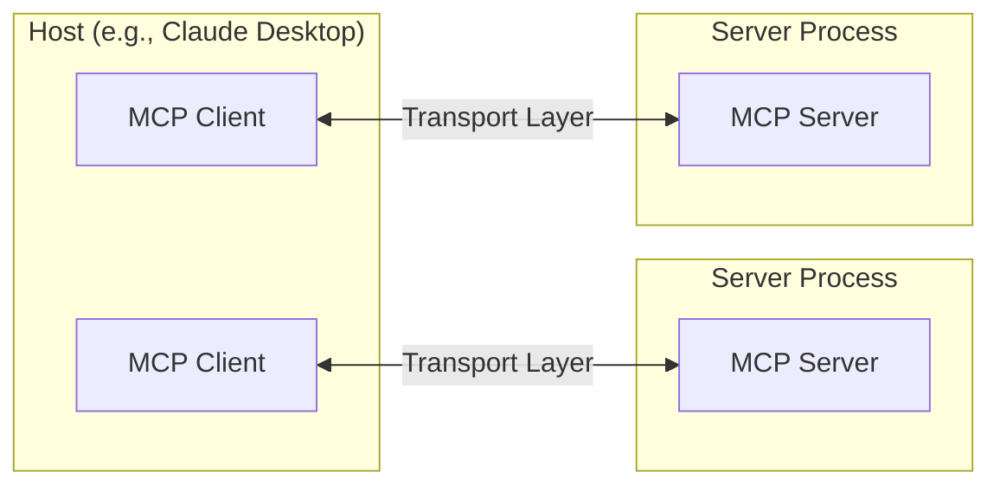
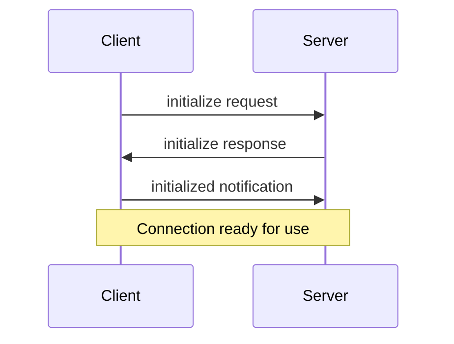
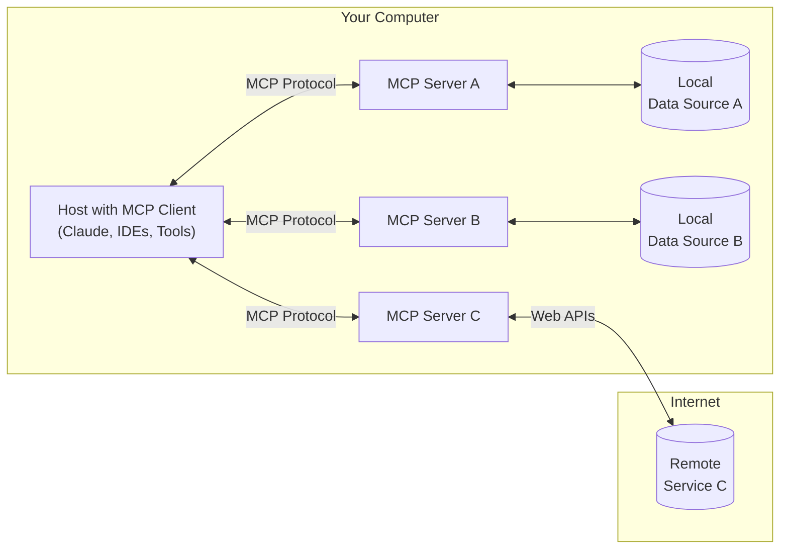

# Example Clients
Source: https://modelcontextprotocol.io/clients

A list of applications that support MCP integrations

This page provides an overview of applications that support the Model Context Protocol (MCP). Each client may support different MCP features, allowing for varying levels of integration with MCP servers.

## Feature support matrix

| Client                               | [Resources] | [Prompts] | [Tools] | [Sampling] | Roots | Notes                                                              |
| ------------------------------------ | ----------- | --------- | ------- | ---------- | ----- | ------------------------------------------------------------------ |
| [Claude Desktop App][Claude]         | ✅           | ✅         | ✅       | ❌          | ❌     | Full support for all MCP features                                  |
| [5ire][5ire]                         | ❌           | ❌         | ✅       | ❌          | ❌     | Supports tools.                                                    |
| [BeeAI Framework][BeeAI Framework]   | ❌           | ❌         | ✅       | ❌          | ❌     | Supports tools in agentic workflows.                               |
| [Cline][Cline]                       | ✅           | ❌         | ✅       | ❌          | ❌     | Supports tools and resources.                                      |
| [Continue][Continue]                 | ✅           | ✅         | ✅       | ❌          | ❌     | Full support for all MCP features                                  |
| [Cursor][Cursor]                     | ❌           | ❌         | ✅       | ❌          | ❌     | Supports tools.                                                    |
| [Emacs Mcp][Mcp.el]                  | ❌           | ❌         | ✅       | ❌          | ❌     | Supports tools in Emacs.                                           |
| [Firebase Genkit][Genkit]            | ⚠️          | ✅         | ✅       | ❌          | ❌     | Supports resource list and lookup through tools.                   |
| [GenAIScript][GenAIScript]           | ❌           | ❌         | ✅       | ❌          | ❌     | Supports tools.                                                    |
| [Goose][Goose]                       | ❌           | ❌         | ✅       | ❌          | ❌     | Supports tools.                                                    |
| [LibreChat][LibreChat]               | ❌           | ❌         | ✅       | ❌          | ❌     | Supports tools for Agents                                          |
| [mcp-agent][mcp-agent]               | ❌           | ❌         | ✅       | ⚠️         | ❌     | Supports tools, server connection management, and agent workflows. |
| [Roo Code][Roo Code]                 | ✅           | ❌         | ✅       | ❌          | ❌     | Supports tools and resources.                                      |
| [Sourcegraph Cody][Cody]             | ✅           | ❌         | ❌       | ❌          | ❌     | Supports resources through OpenCTX                                 |
| [Superinterface][Superinterface]     | ❌           | ❌         | ✅       | ❌          | ❌     | Supports tools                                                     |
| [TheiaAI/TheiaIDE][TheiaAI/TheiaIDE] | ❌           | ❌         | ✅       | ❌          | ❌     | Supports tools for Agents in Theia AI and the AI-powered Theia IDE |
| [Windsurf Editor][Windsurf]          | ❌           | ❌         | ✅       | ❌          | ❌     | Supports tools with AI Flow for collaborative development.         |
| [Zed][Zed]                           | ❌           | ✅         | ❌       | ❌          | ❌     | Prompts appear as slash commands                                   |
| \[OpenSumi]\[OpenSumi]               | ❌           | ❌         | ✅       | ❌          | ❌     | Supports tools in OpenSumi                                         |

[Claude]: https://claude.ai/download

[Cursor]: https://cursor.com

[Zed]: https://zed.dev

[Cody]: https://sourcegraph.com/cody

[Genkit]: https://github.com/firebase/genkit

[Continue]: https://github.com/continuedev/continue

[GenAIScript]: https://microsoft.github.io/genaiscript/reference/scripts/mcp-tools/

[Cline]: https://github.com/cline/cline

[LibreChat]: https://github.com/danny-avila/LibreChat

[TheiaAI/TheiaIDE]: https://eclipsesource.com/blogs/2024/12/19/theia-ide-and-theia-ai-support-mcp/

[Superinterface]: https://superinterface.ai

[5ire]: https://github.com/nanbingxyz/5ire

[BeeAI Framework]: https://i-am-bee.github.io/beeai-framework

[mcp-agent]: https://github.com/lastmile-ai/mcp-agent

[Mcp.el]: https://github.com/lizqwerscott/mcp.el

[Roo Code]: https://roocode.com

[Goose]: https://block.github.io/goose/docs/goose-architecture/#interoperability-with-extensions

[Windsurf]: https://codeium.com/windsurf

[Resources]: https://modelcontextprotocol.io/docs/concepts/resources

[Prompts]: https://modelcontextprotocol.io/docs/concepts/prompts

[Tools]: https://modelcontextprotocol.io/docs/concepts/tools

[Sampling]: https://modelcontextprotocol.io/docs/concepts/sampling

## Client details

### Claude Desktop App

The Claude desktop application provides comprehensive support for MCP, enabling deep integration with local tools and data sources.

**Key features:**

* Full support for resources, allowing attachment of local files and data
* Support for prompt templates
* Tool integration for executing commands and scripts
* Local server connections for enhanced privacy and security

> ⓘ Note: The Claude.ai web application does not currently support MCP. MCP features are only available in the desktop application.

### 5ire

@5ire is an open source cross-platform desktop AI assistant that supports tools through MCP servers.

**Key features:**

* Built-in MCP servers can be quickly enabled and disabled.
* Users can add more servers by modifying the configuration file.
* It is open-source and user-friendly, suitable for beginners.
* Future support for MCP will be continuously improved.

### BeeAI Framework

@BeeAI Framework is an open-source framework for building, deploying, and serving powerful agentic workflows at scale. The framework includes the **MCP Tool**, a native feature that simplifies the integration of MCP servers into agentic workflows.

**Key features:**

* Seamlessly incorporate MCP tools into agentic workflows.
* Quickly instantiate framework-native tools from connected MCP client(s).
* Planned future support for agentic MCP capabilities.

**Learn more:**

* @Example of using MCP tools in agentic workflow

### Cline

@Cline is an autonomous coding agent in VS Code that edits files, runs commands, uses a browser, and more–with your permission at each step.

**Key features:**

* Create and add tools through natural language (e.g. "add a tool that searches the web")
* Share custom MCP servers Cline creates with others via the `~/Documents/Cline/MCP` directory
* Displays configured MCP servers along with their tools, resources, and any error logs

### Continue

@Continue is an open-source AI code assistant, with built-in support for all MCP features.

**Key features**

* Type "@" to mention MCP resources
* Prompt templates surface as slash commands
* Use both built-in and MCP tools directly in chat
* Supports VS Code and JetBrains IDEs, with any LLM

### Cursor

@Cursor is an AI code editor.

**Key Features**:

* Support for MCP tools in Cursor Composer
* Support for both STDIO and SSE

### Emacs Mcp

@Emacs Mcp is an Emacs client designed to interface with MCP servers, enabling seamless connections and interactions. It provides MCP tool invocation support for AI plugins like @gptel and @llm, adhering to Emacs' standard tool invocation format. This integration enhances the functionality of AI tools within the Emacs ecosystem.

**Key features:**

* Provides MCP tool support for Emacs.

### Firebase Genkit

@Genkit is Firebase's SDK for building and integrating GenAI features into applications. The @genkitx-mcp plugin enables consuming MCP servers as a client or creating MCP servers from Genkit tools and prompts.

**Key features:**

* Client support for tools and prompts (resources partially supported)
* Rich discovery with support in Genkit's Dev UI playground
* Seamless interoperability with Genkit's existing tools and prompts
* Works across a wide variety of GenAI models from top providers

### GenAIScript

Programmatically assemble prompts for LLMs using @GenAIScript (in JavaScript). Orchestrate LLMs, tools, and data in JavaScript.

**Key features:**

* JavaScript toolbox to work with prompts
* Abstraction to make it easy and productive
* Seamless Visual Studio Code integration

### Goose

@Goose is an open source AI agent that supercharges your software development by automating coding tasks.

**Key features:**

* Expose MCP functionality to Goose through tools.
* MCPs can be installed directly via the @extensions directory, CLI, or UI.
* Goose allows you to extend its functionality by @building your own MCP servers.
* Includes built-in tools for development, web scraping, automation, memory, and integrations with JetBrains and Google Drive.

### LibreChat

@LibreChat is an open-source, customizable AI chat UI that supports multiple AI providers, now including MCP integration.

**Key features:**

* Extend current tool ecosystem, including @Code Interpreter and Image generation tools, through MCP servers
* Add tools to customizable @Agents, using a variety of LLMs from top providers
* Open-source and self-hostable, with secure multi-user support
* Future roadmap includes expanded MCP feature support

### mcp-agent

[mcp-agent] is a simple, composable framework to build agents using Model Context Protocol.

**Key features:**

* Automatic connection management of MCP servers.
* Expose tools from multiple servers to an LLM.
* Implements every pattern defined in @Building Effective Agents.
* Supports workflow pause/resume signals, such as waiting for human feedback.

### Roo Code

@Roo Code enables AI coding assistance via MCP.

**Key features:**

* Support for MCP tools and resources
* Integration with development workflows
* Extensible AI capabilities

### Sourcegraph Cody

@Cody is Sourcegraph's AI coding assistant, which implements MCP through OpenCTX.

**Key features:**

* Support for MCP resources
* Integration with Sourcegraph's code intelligence
* Uses OpenCTX as an abstraction layer
* Future support planned for additional MCP features

### Superinterface

@Superinterface is AI infrastructure and a developer platform to build in-app AI assistants with support for MCP, interactive components, client-side function calling and more.

**Key features:**

* Use tools from MCP servers in assistants embedded via React components or script tags
* SSE transport support
* Use any AI model from any AI provider (OpenAI, Anthropic, Ollama, others)

### TheiaAI/TheiaIDE

@Theia AI is a framework for building AI-enhanced tools and IDEs. The @AI-powered Theia IDE is an open and flexible development environment built on Theia AI.

**Key features:**

* **Tool Integration**: Theia AI enables AI agents, including those in the Theia IDE, to utilize MCP servers for seamless tool interaction.
* **Customizable Prompts**: The Theia IDE allows users to define and adapt prompts, dynamically integrating MCP servers for tailored workflows.
* **Custom agents**: The Theia IDE supports creating custom agents that leverage MCP capabilities, enabling users to design dedicated workflows on the fly.

Theia AI and Theia IDE's MCP integration provide users with flexibility, making them powerful platforms for exploring and adapting MCP.

**Learn more:**

* @Theia IDE and Theia AI MCP Announcement
* @Download the AI-powered Theia IDE

### Windsurf Editor

@Windsurf Editor is an agentic IDE that combines AI assistance with developer workflows. It features an innovative AI Flow system that enables both collaborative and independent AI interactions while maintaining developer control.

**Key features:**

* Revolutionary AI Flow paradigm for human-AI collaboration
* Intelligent code generation and understanding
* Rich development tools with multi-model support

### Zed

@Zed is a high-performance code editor with built-in MCP support, focusing on prompt templates and tool integration.

**Key features:**

* Prompt templates surface as slash commands in the editor
* Tool integration for enhanced coding workflows
* Tight integration with editor features and workspace context
* Does not support MCP resources

### OpenSumi

@OpenSumi is a framework helps you quickly build AI Native IDE products.

**Key features:**

* Supports MCP tools in OpenSumi
* Supports built-in IDE MCP servers and custom MCP servers

## Adding MCP support to your application

If you've added MCP support to your application, we encourage you to submit a pull request to add it to this list. MCP integration can provide your users with powerful contextual AI capabilities and make your application part of the growing MCP ecosystem.

Benefits of adding MCP support:

* Enable users to bring their own context and tools
* Join a growing ecosystem of interoperable AI applications
* Provide users with flexible integration options
* Support local-first AI workflows

To get started with implementing MCP in your application, check out our @Python or @TypeScript SDK Documentation

# Core architecture
Source: https://modelcontextprotocol.io/docs/concepts/architecture

Understand how MCP connects clients, servers, and LLMs

The Model Context Protocol (MCP) is built on a flexible, extensible architecture that enables seamless communication between LLM applications and integrations. This document covers the core architectural components and concepts.

## Overview

MCP follows a client-server architecture where:

*   **Hosts** are LLM applications (like Claude Desktop or IDEs) that initiate connections
*   **Clients** maintain 1:1 connections with servers, inside the host application
*   **Servers** provide context, tools, and prompts to clients



## Core components

### Protocol layer

The protocol layer handles message framing, request/response linking, and high-level communication patterns.

```typescript
class Protocol<Request, Notification, Result> {
    // Handle incoming requests
    setRequestHandler<T>(schema: T, handler: (request: T, extra: RequestHandlerExtra) => Promise<Result>): void

    // Handle incoming notifications
    setNotificationHandler<T>(schema: T, handler: (notification: T) => Promise<void>): void

    // Send requests and await responses
    request<T>(request: Request, schema: T, options?: RequestOptions): Promise<T>

    // Send one-way notifications
    notification(notification: Notification): Promise<void>
}
```

### Transport layer

The transport layer handles the actual communication between clients and servers. MCP supports multiple transport mechanisms:

1.  **Stdio transport**
    *   Uses standard input/output for communication
    *   Ideal for local processes

2.  **HTTP with SSE transport**
    *   Uses Server-Sent Events for server-to-client messages
    *   HTTP POST for client-to-server messages

All transports use @JSON-RPC 2.0 to exchange messages. See the @specification for detailed information about the Model Context Protocol message format.

### Message types

MCP has these main types of messages:

1.  **Requests** expect a response from the other side:
    ```typescript
    interface Request {
      method: string;
      params?: { ... };
    }
    ```

2.  **Results** are successful responses to requests:
    ```typescript
    interface Result {
      [key: string]: unknown;
    }
    ```

3.  **Errors** indicate that a request failed:
    ```typescript
    interface Error {
      code: number;
      message: string;
      data?: unknown;
    }
    ```

4.  **Notifications** are one-way messages that don't expect a response:
    ```typescript
    interface Notification {
      method: string;
      params?: { ... };
    }
    ```

## Connection lifecycle

### 1. Initialization



1.  Client sends `initialize` request with protocol version and capabilities
2.  Server responds with its protocol version and capabilities
3.  Client sends `initialized` notification as acknowledgment
4.  Normal message exchange begins

### 2. Message exchange

After initialization, the following patterns are supported:

*   **Request-Response**: Client or server sends requests, the other responds
*   **Notifications**: Either party sends one-way messages

### 3. Termination

Either party can terminate the connection:

*   Clean shutdown via `close()`
*   Transport disconnection
*   Error conditions

## Error handling

MCP defines these standard error codes:

```typescript
enum ErrorCode {
  // Standard JSON-RPC error codes
  ParseError = -32700,
  InvalidRequest = -32600,
  MethodNotFound = -32601,
  InvalidParams = -32602,
  InternalError = -32603
}
```

SDKs and applications can define their own error codes above -32000.

Errors are propagated through:

*   Error responses to requests
*   Error events on transports
*   Protocol-level error handlers

## Implementation example

Here's a basic example of implementing an MCP server:

```typescript
import { Server } from "@modelcontextprotocol/sdk/server/index.js";
import { StdioServerTransport } from "@modelcontextprotocol/sdk/server/stdio.js";

const server = new Server({
  name: "example-server",
  version: "1.0.0"
}, {
  capabilities: {
    resources: {}
  }
});

// Handle requests
server.setRequestHandler(ListResourcesRequestSchema, async () => {
  return {
    resources: [
      {
        uri: "example://resource",
        name: "Example Resource"
      }
    ]
  };
});

// Connect transport
const transport = new StdioServerTransport();
await server.connect(transport);
```

## Best practices

### Transport selection

1.  **Local communication**
    *   Use stdio transport for local processes
    *   Efficient for same-machine communication
    *   Simple process management

2.  **Remote communication**
    *   Use SSE for scenarios requiring HTTP compatibility
    *   Consider security implications including authentication and authorization

### Message handling

1.  **Request processing**
    *   Validate inputs thoroughly
    *   Use type-safe schemas
    *   Handle errors gracefully
    *   Implement timeouts

2.  **Progress reporting**
    *   Use progress tokens for long operations
    *   Report progress incrementally
    *   Include total progress when known

3.  **Error management**
    *   Use appropriate error codes
    *   Include helpful error messages
    *   Clean up resources on errors

## Security considerations

1.  **Transport security**
    *   Use TLS for remote connections
    *   Validate connection origins
    *   Implement authentication when needed

2.  **Message validation**
    *   Validate all incoming messages
    *   Sanitize inputs
    *   Check message size limits
    *   Verify JSON-RPC format

3.  **Resource protection**
    *   Implement access controls
    *   Validate resource paths
    *   Monitor resource usage
    *   Rate limit requests

4.  **Error handling**
    *   Don't leak sensitive information
    *   Log security-relevant errors
    *   Implement proper cleanup
    *   Handle DoS scenarios

## Debugging and monitoring

1.  **Logging**
    *   Log protocol events
    *   Track message flow
    *   Monitor performance
    *   Record errors

2.  **Diagnostics**
    *   Implement health checks
    *   Monitor connection state
    *   Track resource usage
    *   Profile performance

3.  **Testing**
    *   Test different transports
    *   Verify error handling
    *   Check edge cases
    *   Load test servers


# Prompts
Source: https://modelcontextprotocol.io/docs/concepts/prompts

Create reusable prompt templates and workflows

Prompts enable servers to define reusable prompt templates and workflows that clients can easily surface to users and LLMs. They provide a powerful way to standardize and share common LLM interactions.

<Note>
  Prompts are designed to be **user-controlled**, meaning they are exposed from servers to clients with the intention of the user being able to explicitly select them for use.
</Note>

## Overview

Prompts in MCP are predefined templates that can:

*   Accept dynamic arguments
*   Include context from resources
*   Chain multiple interactions
*   Guide specific workflows
*   Surface as UI elements (like slash commands)

## Prompt structure

Each prompt is defined with:

```typescript
{
  name: string;              // Unique identifier for the prompt
  description?: string;      // Human-readable description
  arguments?: [              // Optional list of arguments
    {
      name: string;          // Argument identifier
      description?: string;  // Argument description
      required?: boolean;    // Whether argument is required
    }
  ]
}
```

## Discovering prompts

Clients can discover available prompts through the `prompts/list` endpoint:

```typescript
// Request
{
  method: "prompts/list"
}

// Response
{
  prompts: [
    {
      name: "analyze-code",
      description: "Analyze code for potential improvements",
      arguments: [
        {
          name: "language",
          description: "Programming language",
          required: true
        }
      ]
    }
  ]
}
```

## Using prompts

To use a prompt, clients make a `prompts/get` request:

```typescript
// Request
{
  method: "prompts/get",
  params: {
    name: "analyze-code",
    arguments: {
      language: "python"
    }
  }
}

// Response
{
  description: "Analyze Python code for potential improvements",
  messages: [
    {
      role: "user",
      content: {
        type: "text",
        text: "Please analyze the following Python code for potential improvements:\n\n```python\ndef calculate_sum(numbers):\n    total = 0\n    for num in numbers:\n        total = total + num\n    return total\n\nresult = calculate_sum([1, 2, 3, 4, 5])\nprint(result)\n```"
      }
    }
  ]
}
```

## Dynamic prompts

Prompts can be dynamic and include:

### Embedded resource context

```json
{
  "name": "analyze-project",
  "description": "Analyze project logs and code",
  "arguments": [
    {
      "name": "timeframe",
      "description": "Time period to analyze logs",
      "required": true
    },
    {
      "name": "fileUri",
      "description": "URI of code file to review",
      "required": true
    }
  ]
}
```

When handling the `prompts/get` request:

```json
{
  "messages": [
    {
      "role": "user",
      "content": {
        "type": "text",
        "text": "Analyze these system logs and the code file for any issues:"
      }
    },
    {
      "role": "user",
      "content": {
        "type": "resource",
        "resource": {
          "uri": "logs://recent?timeframe=1h",
          "text": "[2024-03-14 15:32:11] ERROR: Connection timeout in network.py:127\n[2024-03-14 15:32:15] WARN: Retrying connection (attempt 2/3)\n[2024-03-14 15:32:20] ERROR: Max retries exceeded",
          "mimeType": "text/plain"
        }
      }
    },
    {
      "role": "user",
      "content": {
        "type": "resource",
        "resource": {
          "uri": "file:///path/to/code.py",
          "text": "def connect_to_service(timeout=30):\n    retries = 3\n    for attempt in range(retries):\n        try:\n            return establish_connection(timeout)\n        except TimeoutError:\n            if attempt == retries - 1:\n                raise\n            time.sleep(5)\n\ndef establish_connection(timeout):\n    # Connection implementation\n    pass",
          "mimeType": "text/x-python"
        }
      }
    }
  ]
}
```

### Multi-step workflows

```typescript
const debugWorkflow = {
  name: "debug-error",
  async getMessages(error: string) {
    return [
      {
        role: "user",
        content: {
          type: "text",
          text: `Here's an error I'm seeing: ${error}`
        }
      },
      {
        role: "assistant",
        content: {
          type: "text",
          text: "I'll help analyze this error. What have you tried so far?"
        }
      },
      {
        role: "user",
        content: {
          type: "text",
          text: "I've tried restarting the service, but the error persists."
        }
      }
    ];
  }
};
```

## Example implementation

Here's a complete example of implementing prompts in an MCP server:

```typescript
import { Server } from "@modelcontextprotocol/sdk/server";
import {
  ListPromptsRequestSchema,
  GetPromptRequestSchema
} from "@modelcontextprotocol/sdk/types";

const PROMPTS = {
  "git-commit": {
    name: "git-commit",
    description: "Generate a Git commit message",
    arguments: [
      {
        name: "changes",
        description: "Git diff or description of changes",
        required: true
      }
    ]
  },
  "explain-code": {
    name: "explain-code",
    description: "Explain how code works",
    arguments: [
      {
        name: "code",
        description: "Code to explain",
        required: true
      },
      {
        name: "language",
        description: "Programming language",
        required: false
      }
    ]
  }
};

const server = new Server({
  name: "example-prompts-server",
  version: "1.0.0"
}, {
  capabilities: {
    prompts: {}
  }
});

// List available prompts
server.setRequestHandler(ListPromptsRequestSchema, async () => {
  return {
    prompts: Object.values(PROMPTS)
  };
});

// Get specific prompt
server.setRequestHandler(GetPromptRequestSchema, async (request) => {
  const prompt = PROMPTS[request.params.name];
  if (!prompt) {
    throw new Error(`Prompt not found: ${request.params.name}`);
  }

  if (request.params.name === "git-commit") {
    return {
      messages: [
        {
          role: "user",
          content: {
            type: "text",
            text: `Generate a concise but descriptive commit message for these changes:\n\n${request.params.arguments?.changes}`
          }
        }
      ]
    };
  }

  if (request.params.name === "explain-code") {
    const language = request.params.arguments?.language || "Unknown";
    return {
      messages: [
        {
          role: "user",
          content: {
            type: "text",
            text: `Explain how this ${language} code works:\n\n${request.params.arguments?.code}`
          }
        }
      ]
    };
  }

  throw new Error("Prompt implementation not found");
});
```

## Best practices

When implementing prompts:

1.  Use clear, descriptive prompt names
2.  Provide detailed descriptions for prompts and arguments
3.  Validate all required arguments
4.  Handle missing arguments gracefully
5.  Consider versioning for prompt templates
6.  Cache dynamic content when appropriate
7.  Implement error handling
8.  Document expected argument formats
9.  Consider prompt composability
10. Test prompts with various inputs

## UI integration

Prompts can be surfaced in client UIs as:

*   Slash commands
*   Quick actions
*   Context menu items
*   Command palette entries
*   Guided workflows
*   Interactive forms

## Updates and changes

Servers can notify clients about prompt changes:

1.  Server capability: `prompts.listChanged`
2.  Notification: `notifications/prompts/list_changed`
3.  Client re-fetches prompt list

## Security considerations

When implementing prompts:

*   Validate all arguments
*   Sanitize user input
*   Consider rate limiting
*   Implement access controls
*   Audit prompt usage
*   Handle sensitive data appropriately
*   Validate generated content
*   Implement timeouts
*   Consider prompt injection risks
*   Document security requirements


# Resources
Source: https://modelcontextprotocol.io/docs/concepts/resources

Expose data and content from your servers to LLMs

Resources are a core primitive in the Model Context Protocol (MCP) that allow servers to expose data and content that can be read by clients and used as context for LLM interactions.

<Note>
  Resources are designed to be **application-controlled**, meaning that the client application can decide how and when they should be used.
  Different MCP clients may handle resources differently. For example:

  *   Claude Desktop currently requires users to explicitly select resources before they can be used
  *   Other clients might automatically select resources based on heuristics
  *   Some implementations may even allow the AI model itself to determine which resources to use

  Server authors should be prepared to handle any of these interaction patterns when implementing resource support. In order to expose data to models automatically, server authors should use a **model-controlled** primitive such as @Tools.
</Note>

## Overview

Resources represent any kind of data that an MCP server wants to make available to clients. This can include:

*   File contents
*   Database records
*   API responses
*   Live system data
*   Screenshots and images
*   Log files
*   And more

Each resource is identified by a unique URI and can contain either text or binary data.

## Resource URIs

Resources are identified using URIs that follow this format:

```
[protocol]://[host]/[path]
```

For example:

*   `file:///home/user/documents/report.pdf`
*   `postgres://database/customers/schema`
*   `screen://localhost/display1`

The protocol and path structure is defined by the MCP server implementation. Servers can define their own custom URI schemes.

## Resource types

Resources can contain two types of content:

### Text resources

Text resources contain UTF-8 encoded text data. These are suitable for:

*   Source code
*   Configuration files
*   Log files
*   JSON/XML data
*   Plain text

### Binary resources

Binary resources contain raw binary data encoded in base64. These are suitable for:

*   Images
*   PDFs
*   Audio files
*   Video files
*   Other non-text formats

## Resource discovery

Clients can discover available resources through two main methods:

### Direct resources

Servers expose a list of concrete resources via the `resources/list` endpoint. Each resource includes:

```typescript
{
  uri: string;           // Unique identifier for the resource
  name: string;          // Human-readable name
  description?: string;  // Optional description
  mimeType?: string;     // Optional MIME type
}
```

### Resource templates

For dynamic resources, servers can expose @URI templates that clients can use to construct valid resource URIs:

```typescript
{
  uriTemplate: string;   // URI template following RFC 6570
  name: string;          // Human-readable name for this type
  description?: string;  // Optional description
  mimeType?: string;     // Optional MIME type for all matching resources
}
```

## Reading resources

To read a resource, clients make a `resources/read` request with the resource URI.

The server responds with a list of resource contents:

```typescript
{
  contents: [
    {
      uri: string;        // The URI of the resource
      mimeType?: string;  // Optional MIME type

      // One of:
      text?: string;      // For text resources
      blob?: string;      // For binary resources (base64 encoded)
    }
  ]
}
```

<Tip>
  Servers may return multiple resources in response to one `resources/read` request. This could be used, for example, to return a list of files inside a directory when the directory is read.
</Tip>

## Resource updates

MCP supports real-time updates for resources through two mechanisms:

### List changes

Servers can notify clients when their list of available resources changes via the `notifications/resources/list_changed` notification.

### Content changes

Clients can subscribe to updates for specific resources:

1.  Client sends `resources/subscribe` with resource URI
2.  Server sends `notifications/resources/updated` when the resource changes
3.  Client can fetch latest content with `resources/read`
4.  Client can unsubscribe with `resources/unsubscribe`

## Example implementation

Here's a simple example of implementing resource support in an MCP server:

```typescript
const server = new Server({
  name: "example-server",
  version: "1.0.0"
}, {
  capabilities: {
    resources: {}
  }
});

// List available resources
server.setRequestHandler(ListResourcesRequestSchema, async () => {
  return {
    resources: [
      {
        uri: "file:///logs/app.log",
        name: "Application Logs",
        mimeType: "text/plain"
      }
    ]
  };
});

// Read resource contents
server.setRequestHandler(ReadResourceRequestSchema, async (request) => {
  const uri = request.params.uri;

  if (uri === "file:///logs/app.log") {
    const logContents = await readLogFile();
    return {
      contents: [
        {
          uri,
          mimeType: "text/plain",
          text: logContents
        }
      ]
    };
  }

  throw new Error("Resource not found");
});
```

## Best practices

When implementing resource support:

1.  Use clear, descriptive resource names and URIs
2.  Include helpful descriptions to guide LLM understanding
3.  Set appropriate MIME types when known
4.  Implement resource templates for dynamic content
5.  Use subscriptions for frequently changing resources
6.  Handle errors gracefully with clear error messages
7.  Consider pagination for large resource lists
8.  Cache resource contents when appropriate
9.  Validate URIs before processing
10. Document your custom URI schemes

## Security considerations

When exposing resources:

*   Validate all resource URIs
*   Implement appropriate access controls
*   Sanitize file paths to prevent directory traversal
*   Be cautious with binary data handling
*   Consider rate limiting for resource reads
*   Audit resource access
*   Encrypt sensitive data in transit
*   Validate MIME types
*   Implement timeouts for long-running reads
*   Handle resource cleanup appropriately


# Roots
Source: https://modelcontextprotocol.io/docs/concepts/roots

Understanding roots in MCP

Roots are a concept in MCP that define the boundaries where servers can operate. They provide a way for clients to inform servers about relevant resources and their locations.

## What are Roots?

A root is a URI that a client suggests a server should focus on. When a client connects to a server, it declares which roots the server should work with. While primarily used for filesystem paths, roots can be any valid URI including HTTP URLs.

For example, roots could be:

```
file:///home/user/projects/myapp
https://api.example.com/v1
```

## Why Use Roots?

Roots serve several important purposes:

1.  **Guidance**: They inform servers about relevant resources and locations
2.  **Clarity**: Roots make it clear which resources are part of your workspace
3.  **Organization**: Multiple roots let you work with different resources simultaneously

## How Roots Work

When a client supports roots, it:

1.  Declares the `roots` capability during connection
2.  Provides a list of suggested roots to the server
3.  Notifies the server when roots change (if supported)

While roots are informational and not strictly enforcing, servers should:

1.  Respect the provided roots
2.  Use root URIs to locate and access resources
3.  Prioritize operations within root boundaries

## Common Use Cases

Roots are commonly used to define:

*   Project directories
*   Repository locations
*   API endpoints
*   Configuration locations
*   Resource boundaries

## Best Practices

When working with roots:

1.  Only suggest necessary resources
2.  Use clear, descriptive names for roots
3.  Monitor root accessibility
4.  Handle root changes gracefully

## Example

Here's how a typical MCP client might expose roots:

```json
{
  "roots": [
    {
      "uri": "file:///home/user/projects/frontend",
      "name": "Frontend Repository"
    },
    {
      "uri": "https://api.example.com/v1",
      "name": "API Endpoint"
    }
  ]
}
```

This configuration suggests the server focus on both a local repository and an API endpoint while keeping them logically separated.


# Sampling
Source: https://modelcontextprotocol.io/docs/concepts/sampling

Let your servers request completions from LLMs

Sampling is a powerful MCP feature that allows servers to request LLM completions through the client, enabling sophisticated agentic behaviors while maintaining security and privacy.

<Info>
  This feature of MCP is not yet supported in the Claude Desktop client.
</Info>

## How sampling works

The sampling flow follows these steps:

1.  Server sends a `sampling/createMessage` request to the client
2.  Client reviews the request and can modify it
3.  Client samples from an LLM
4.  Client reviews the completion
5.  Client returns the result to the server

This human-in-the-loop design ensures users maintain control over what the LLM sees and generates.

## Message format

Sampling requests use a standardized message format:

```typescript
{
  messages: [
    {
      role: "user" | "assistant",
      content: {
        type: "text" | "image",

        // For text:
        text?: string,

        // For images:
        data?: string,             // base64 encoded
        mimeType?: string
      }
    }
  ],
  modelPreferences?: {
    hints?: [{
      name?: string                // Suggested model name/family
    }],
    costPriority?: number,         // 0-1, importance of minimizing cost
    speedPriority?: number,        // 0-1, importance of low latency
    intelligencePriority?: number  // 0-1, importance of capabilities
  },
  systemPrompt?: string,
  includeContext?: "none" | "thisServer" | "allServers",
  temperature?: number,
  maxTokens: number,
  stopSequences?: string[],
  metadata?: Record<string, unknown>
}
```

## Request parameters

### Messages

The `messages` array contains the conversation history to send to the LLM. Each message has:

*   `role`: Either "user" or "assistant"
*   `content`: The message content, which can be:
    *   Text content with a `text` field
    *   Image content with `data` (base64) and `mimeType` fields

### Model preferences

The `modelPreferences` object allows servers to specify their model selection preferences:

*   `hints`: Array of model name suggestions that clients can use to select an appropriate model:
    *   `name`: String that can match full or partial model names (e.g. "claude-3", "sonnet")
    *   Clients may map hints to equivalent models from different providers
    *   Multiple hints are evaluated in preference order

*   Priority values (0-1 normalized):
    *   `costPriority`: Importance of minimizing costs
    *   `speedPriority`: Importance of low latency response
    *   `intelligencePriority`: Importance of advanced model capabilities

Clients make the final model selection based on these preferences and their available models.

### System prompt

An optional `systemPrompt` field allows servers to request a specific system prompt. The client may modify or ignore this.

### Context inclusion

The `includeContext` parameter specifies what MCP context to include:

*   `"none"`: No additional context
*   `"thisServer"`: Include context from the requesting server
*   `"allServers"`: Include context from all connected MCP servers

The client controls what context is actually included.

### Sampling parameters

Fine-tune the LLM sampling with:

*   `temperature`: Controls randomness (0.0 to 1.0)
*   `maxTokens`: Maximum tokens to generate
*   `stopSequences`: Array of sequences that stop generation
*   `metadata`: Additional provider-specific parameters

## Response format

The client returns a completion result:

```typescript
{
  model: string,  // Name of the model used
  stopReason?: "endTurn" | "stopSequence" | "maxTokens" | string,
  role: "user" | "assistant",
  content: {
    type: "text" | "image",
    text?: string,
    data?: string,
    mimeType?: string
  }
}
```

## Example request

Here's an example of requesting sampling from a client:

```json
{
  "method": "sampling/createMessage",
  "params": {
    "messages": [
      {
        "role": "user",
        "content": {
          "type": "text",
          "text": "What files are in the current directory?"
        }
      }
    ],
    "systemPrompt": "You are a helpful file system assistant.",
    "includeContext": "thisServer",
    "maxTokens": 100
  }
}
```

## Best practices

When implementing sampling:

1.  Always provide clear, well-structured prompts
2.  Handle both text and image content appropriately
3.  Set reasonable token limits
4.  Include relevant context through `includeContext`
5.  Validate responses before using them
6.  Handle errors gracefully
7.  Consider rate limiting sampling requests
8.  Document expected sampling behavior
9.  Test with various model parameters
10. Monitor sampling costs

## Human in the loop controls

Sampling is designed with human oversight in mind:

### For prompts

*   Clients should show users the proposed prompt
*   Users should be able to modify or reject prompts
*   System prompts can be filtered or modified
*   Context inclusion is controlled by the client

### For completions

*   Clients should show users the completion
*   Users should be able to modify or reject completions
*   Clients can filter or modify completions
*   Users control which model is used

## Security considerations

When implementing sampling:

*   Validate all message content
*   Sanitize sensitive information
*   Implement appropriate rate limits
*   Monitor sampling usage
*   Encrypt data in transit
*   Handle user data privacy
*   Audit sampling requests
*   Control cost exposure
*   Implement timeouts
*   Handle model errors gracefully

## Common patterns

### Agentic workflows

Sampling enables agentic patterns like:

*   Reading and analyzing resources
*   Making decisions based on context
*   Generating structured data
*   Handling multi-step tasks
*   Providing interactive assistance

### Context management

Best practices for context:

*   Request minimal necessary context
*   Structure context clearly
*   Handle context size limits
*   Update context as needed
*   Clean up stale context

### Error handling

Robust error handling should:

*   Catch sampling failures
*   Handle timeout errors
*   Manage rate limits
*   Validate responses
*   Provide fallback behaviors
*   Log errors appropriately

## Limitations

Be aware of these limitations:

*   Sampling depends on client capabilities
*   Users control sampling behavior
*   Context size has limits
*   Rate limits may apply
*   Costs should be considered
*   Model availability varies
*   Response times vary
*   Not all content types supported


# Tools
Source: https://modelcontextprotocol.io/docs/concepts/tools

Enable LLMs to perform actions through your server

Tools are a powerful primitive in the Model Context Protocol (MCP) that enable servers to expose executable functionality to clients. Through tools, LLMs can interact with external systems, perform computations, and take actions in the real world.

<Note>
  Tools are designed to be **model-controlled**, meaning that tools are exposed from servers to clients with the intention of the AI model being able to automatically invoke them (with a human in the loop to grant approval).
</Note>

## Overview

Tools in MCP allow servers to expose executable functions that can be invoked by clients and used by LLMs to perform actions. Key aspects of tools include:

*   **Discovery**: Clients can list available tools through the `tools/list` endpoint
*   **Invocation**: Tools are called using the `tools/call` endpoint, where servers perform the requested operation and return results
*   **Flexibility**: Tools can range from simple calculations to complex API interactions

Like @resources, tools are identified by unique names and can include descriptions to guide their usage. However, unlike resources, tools represent dynamic operations that can modify state or interact with external systems.

## Tool definition structure

Each tool is defined with the following structure:

```typescript
{
  name: string;          // Unique identifier for the tool
  description?: string;  // Human-readable description
  inputSchema: {         // JSON Schema for the tool's parameters
    type: "object",
    properties: { ... }  // Tool-specific parameters
  }
}
```

## Implementing tools

Here's an example of implementing a basic tool in an MCP server:

```typescript
const server = new Server({
  name: "example-server",
  version: "1.0.0"
}, {
  capabilities: {
    tools: {}
  }
});

// Define available tools
server.setRequestHandler(ListToolsRequestSchema, async () => {
  return {
    tools: [{
      name: "calculate_sum",
      description: "Add two numbers together",
      inputSchema: {
        type: "object",
        properties: {
          a: { type: "number" },
          b: { type: "number" }
        },
        required: ["a", "b"]
      }
    }]
  };
});

// Handle tool execution
server.setRequestHandler(CallToolRequestSchema, async (request) => {
  if (request.params.name === "calculate_sum") {
    const { a, b } = request.params.arguments;
    return {
      content: [
        {
          type: "text",
          text: String(a + b)
        }
      ]
    };
  }
  throw new Error("Tool not found");
});
```

## Example tool patterns

Here are some examples of types of tools that a server could provide:

### System operations

Tools that interact with the local system:

```typescript
{
  name: "execute_command",
  description: "Run a shell command",
  inputSchema: {
    type: "object",
    properties: {
      command: { type: "string" },
      args: { type: "array", items: { type: "string" } }
    }
  }
}
```

### API integrations

Tools that wrap external APIs:

```typescript
{
  name: "github_create_issue",
  description: "Create a GitHub issue",
  inputSchema: {
    type: "object",
    properties: {
      title: { type: "string" },
      body: { type: "string" },
      labels: { type: "array", items: { type: "string" } }
    }
  }
}
```

### Data processing

Tools that transform or analyze data:

```typescript
{
  name: "analyze_csv",
  description: "Analyze a CSV file",
  inputSchema: {
    type: "object",
    properties: {
      filepath: { type: "string" },
      operations: {
        type: "array",
        items: {
          enum: ["sum", "average", "count"]
        }
      }
    }
  }
}
```

## Best practices

When implementing tools:

1.  Provide clear, descriptive names and descriptions
2.  Use detailed JSON Schema definitions for parameters
3.  Include examples in tool descriptions to demonstrate how the model should use them
4.  Implement proper error handling and validation
5.  Use progress reporting for long operations
6.  Keep tool operations focused and atomic
7.  Document expected return value structures
8.  Implement proper timeouts
9.  Consider rate limiting for resource-intensive operations
10. Log tool usage for debugging and monitoring

## Security considerations

When exposing tools:

### Input validation

*   Validate all parameters against the schema
*   Sanitize file paths and system commands
*   Validate URLs and external identifiers
*   Check parameter sizes and ranges
*   Prevent command injection

### Access control

*   Implement authentication where needed
*   Use appropriate authorization checks
*   Audit tool usage
*   Rate limit requests
*   Monitor for abuse

### Error handling

*   Don't expose internal errors to clients
*   Log security-relevant errors
*   Handle timeouts appropriately
*   Clean up resources after errors
*   Validate return values

## Tool discovery and updates

MCP supports dynamic tool discovery:

1.  Clients can list available tools at any time
2.  Servers can notify clients when tools change using `notifications/tools/list_changed`
3.  Tools can be added or removed during runtime
4.  Tool definitions can be updated (though this should be done carefully)

## Error handling

Tool errors should be reported within the result object, not as MCP protocol-level errors. This allows the LLM to see and potentially handle the error. When a tool encounters an error:

1.  Set `isError` to `true` in the result
2.  Include error details in the `content` array

Here's an example of proper error handling for tools:

```typescript
try {
  // Tool operation
  const result = performOperation();
  return {
    content: [
      {
        type: "text",
        text: `Operation successful: ${result}`
      }
    ]
  };
} catch (error) {
  return {
    isError: true,
    content: [
      {
        type: "text",
        text: `Error: ${error.message}`
      }
    ]
  };
}
```

## Testing tools

A comprehensive testing strategy for MCP tools should cover:

*   **Functional testing**: Verify tools execute correctly with valid inputs and handle invalid inputs appropriately
*   **Integration testing**: Test tool interaction with external systems using both real and mocked dependencies
*   **Security testing**: Validate authentication, authorization, input sanitization, and rate limiting
*   **Performance testing**: Check behavior under load, timeout handling, and resource cleanup
*   **Error handling**: Ensure tools properly report errors through the MCP protocol and clean up resources


# Transports
Source: https://modelcontextprotocol.io/docs/concepts/transports

Learn about MCP's communication mechanisms

Transports in the Model Context Protocol (MCP) provide the foundation for communication between clients and servers. A transport handles the underlying mechanics of how messages are sent and received.

## Message Format

MCP uses @JSON-RPC 2.0 as its wire format. The transport layer is responsible for converting MCP protocol messages into JSON-RPC format for transmission and converting received JSON-RPC messages back into MCP protocol messages.

There are three types of JSON-RPC messages used:

### Requests

```typescript
{
  jsonrpc: "2.0",
  id: number | string,
  method: string,
  params?: object
}
```

### Responses

```typescript
{
  jsonrpc: "2.0",
  id: number | string,
  result?: object,
  error?: {
    code: number,
    message: string,
    data?: unknown
  }
}
```

### Notifications

```typescript
{
  jsonrpc: "2.0",
  method: string,
  params?: object
}
```

## Built-in Transport Types

MCP includes two standard transport implementations:

### Standard Input/Output (stdio)

The stdio transport enables communication through standard input and output streams. This is particularly useful for local integrations and command-line tools.

Use stdio when:

*   Building command-line tools
*   Implementing local integrations
*   Needing simple process communication
*   Working with shell scripts

```typescript
const server = new Server({
  name: "example-server",
  version: "1.0.0"
}, {
  capabilities: {}
});

const transport = new StdioServerTransport();
await server.connect(transport);
```

```typescript
const client = new Client({
  name: "example-client",
  version: "1.0.0"
}, {
  capabilities: {}
});

const transport = new StdioClientTransport({
  command: "./server",
  args: ["--option", "value"]
});
await client.connect(transport);
```

### Server-Sent Events (SSE)

SSE transport enables server-to-client streaming with HTTP POST requests for client-to-server communication.

Use SSE when:

*   Only server-to-client streaming is needed
*   Working with restricted networks
*   Implementing simple updates

```typescript
import express from "express";

const app = express();

const server = new Server({
  name: "example-server",
  version: "1.0.0"
}, {
  capabilities: {}
});

let transport: SSEServerTransport | null = null;

app.get("/sse", (req, res) => {
  transport = new SSEServerTransport("/messages", res);
  server.connect(transport);
});

app.post("/messages", (req, res) => {
  if (transport) {
    transport.handlePostMessage(req, res);
  }
});

app.listen(3000);
```

```typescript
const client = new Client({
  name: "example-client",
  version: "1.0.0"
}, {
  capabilities: {}
});

const transport = new SSEClientTransport(
  new URL("http://localhost:3000/sse")
);
await client.connect(transport);
```

## Custom Transports

MCP makes it easy to implement custom transports for specific needs. Any transport implementation just needs to conform to the Transport interface:

You can implement custom transports for:

*   Custom network protocols
*   Specialized communication channels
*   Integration with existing systems
*   Performance optimization

```typescript
interface Transport {
  // Start processing messages
  start(): Promise<void>;

  // Send a JSON-RPC message
  send(message: JSONRPCMessage): Promise<void>;

  // Close the connection
  close(): Promise<void>;

  // Callbacks
  onclose?: () => void;
  onerror?: (error: Error) => void;
  onmessage?: (message: JSONRPCMessage) => void;
}
```

## Error Handling

Transport implementations should handle various error scenarios:

1.  Connection errors
2.  Message parsing errors
3.  Protocol errors
4.  Network timeouts
5.  Resource cleanup

Example error handling:

```typescript
class ExampleTransport implements Transport {
  async start() {
    try {
      // Connection logic
    } catch (error) {
      this.onerror?.(new Error(`Failed to connect: ${error}`));
      throw error;
    }
  }

  async send(message: JSONRPCMessage) {
    try {
      // Sending logic
    } catch (error) {
      this.onerror?.(new Error(`Failed to send message: ${error}`));
      throw error;
    }
  }
}
```

# Debugging
Source: https://modelcontextprotocol.io/docs/tools/debugging

A comprehensive guide to debugging Model Context Protocol (MCP) integrations

Effective debugging is essential when developing MCP servers or integrating them with applications. This guide covers the debugging tools and approaches available in the MCP ecosystem.

<Info>
  This guide is for macOS. Guides for other platforms are coming soon.
</Info>

## Debugging tools overview

MCP provides several tools for debugging at different levels:

1.  **MCP Inspector**
    *   Interactive debugging interface
    *   Direct server testing
    *   See the @Inspector guide for details

2.  **Claude Desktop Developer Tools**
    *   Integration testing
    *   Log collection
    *   Chrome DevTools integration

3.  **Server Logging**
    *   Custom logging implementations
    *   Error tracking
    *   Performance monitoring

## Debugging in Claude Desktop

### Checking server status

The Claude.app interface provides basic server status information:

1.  Click the  icon to view:
    *   Connected servers
    *   Available prompts and resources

2.  Click the  icon to view:
    *   Tools made available to the model

### Viewing logs

Review detailed MCP logs from Claude Desktop:

```bash
# Follow logs in real-time
tail -n 20 -F ~/Library/Logs/Claude/mcp*.log
```

The logs capture:

*   Server connection events
*   Configuration issues
*   Runtime errors
*   Message exchanges

### Using Chrome DevTools

Access Chrome's developer tools inside Claude Desktop to investigate client-side errors:

1.  Create a `developer_settings.json` file with `allowDevTools` set to true:

```bash
echo '{"allowDevTools": true}' > ~/Library/Application\ Support/Claude/developer_settings.json
```

2.  Open DevTools: `Command-Option-Shift-i`

Note: You'll see two DevTools windows:

*   Main content window
*   App title bar window

Use the Console panel to inspect client-side errors.

Use the Network panel to inspect:

*   Message payloads
*   Connection timing

## Common issues

### Working directory

When using MCP servers with Claude Desktop:

*   The working directory for servers launched via `claude_desktop_config.json` may be undefined (like `/` on macOS) since Claude Desktop could be started from anywhere
*   Always use absolute paths in your configuration and `.env` files to ensure reliable operation
*   For testing servers directly via command line, the working directory will be where you run the command

For example in `claude_desktop_config.json`, use:

```json
{
  "command": "npx",
  "args": ["-y", "@modelcontextprotocol/server-filesystem", "/Users/username/data"]
}
```

Instead of relative paths like `./data`

### Environment variables

MCP servers inherit only a subset of environment variables automatically, like `USER`, `HOME`, and `PATH`.

To override the default variables or provide your own, you can specify an `env` key in `claude_desktop_config.json`:

```json
{
  "myserver": {
    "command": "mcp-server-myapp",
    "env": {
      "MYAPP_API_KEY": "some_key",
    }
  }
}
```

### Server initialization

Common initialization problems:

1.  **Path Issues**
    *   Incorrect server executable path
    *   Missing required files
    *   Permission problems
    *   Try using an absolute path for `command`

2.  **Configuration Errors**
    *   Invalid JSON syntax
    *   Missing required fields
    *   Type mismatches

3.  **Environment Problems**
    *   Missing environment variables
    *   Incorrect variable values
    *   Permission restrictions

### Connection problems

When servers fail to connect:

1.  Check Claude Desktop logs
2.  Verify server process is running
3.  Test standalone with @Inspector
4.  Verify protocol compatibility

## Implementing logging

### Server-side logging

When building a server that uses the local stdio @transport, all messages logged to stderr (standard error) will be captured by the host application (e.g., Claude Desktop) automatically.

<Warning>
  Local MCP servers should not log messages to stdout (standard out), as this will interfere with protocol operation.
</Warning>

For all @transports, you can also provide logging to the client by sending a log message notification:

```typescript
server.sendLoggingMessage({
  level: "info",
  data: "Server started successfully",
});
```

Important events to log:

*   Initialization steps
*   Resource access
*   Tool execution
*   Error conditions
*   Performance metrics

### Client-side logging

In client applications:

1.  Enable debug logging
2.  Monitor network traffic
3.  Track message exchanges
4.  Record error states

## Debugging workflow

### Development cycle

1.  Initial Development
    *   Use @Inspector for basic testing
    *   Implement core functionality
    *   Add logging points

2.  Integration Testing
    *   Test in Claude Desktop
    *   Monitor logs
    *   Check error handling

### Testing changes

To test changes efficiently:

*   **Configuration changes**: Restart Claude Desktop
*   **Server code changes**: Use Command-R to reload
*   **Quick iteration**: Use @Inspector during development

## Best practices

### Logging strategy

1.  **Structured Logging**
    *   Use consistent formats
    *   Include context
    *   Add timestamps
    *   Track request IDs

2.  **Error Handling**
    *   Log stack traces
    *   Include error context
    *   Track error patterns
    *   Monitor recovery

3.  **Performance Tracking**
    *   Log operation timing
    *   Monitor resource usage
    *   Track message sizes
    *   Measure latency

### Security considerations

When debugging:

1.  **Sensitive Data**
    *   Sanitize logs
    *   Protect credentials
    *   Mask personal information

2.  **Access Control**
    *   Verify permissions
    *   Check authentication
    *   Monitor access patterns

## Getting help

When encountering issues:

1.  **First Steps**
    *   Check server logs
    *   Test with @Inspector
    *   Review configuration
    *   Verify environment

2.  **Support Channels**
    *   GitHub issues
    *   GitHub discussions

3.  **Providing Information**
    *   Log excerpts
    *   Configuration files
    *   Steps to reproduce
    *   Environment details

## Next steps

<CardGroup cols={2}>
  <Card title="MCP Inspector" icon="magnifying-glass" href="/docs/tools/inspector">
    Learn to use the MCP Inspector
  </Card>
</CardGroup>


# Inspector
Source: https://modelcontextprotocol.io/docs/tools/inspector

In-depth guide to using the MCP Inspector for testing and debugging Model Context Protocol servers

The @MCP Inspector is an interactive developer tool for testing and debugging MCP servers. While the @Debugging Guide covers the Inspector as part of the overall debugging toolkit, this document provides a detailed exploration of the Inspector's features and capabilities.

## Getting started

### Installation and basic usage

The Inspector runs directly through `npx` without requiring installation:

```bash
npx @modelcontextprotocol/inspector <command>
```

```bash
npx @modelcontextprotocol/inspector <command> <arg1> <arg2>
```

#### Inspecting servers from NPM or PyPi

A common way to start server packages from @NPM or @PyPi.

<Tabs>
  <Tab title="NPM package">
    ```bash
    npx -y @modelcontextprotocol/inspector npx <package-name> <args>
    # For example
    npx -y @modelcontextprotocol/inspector npx server-postgres postgres://127.0.0.1/testdb
    ```
  </Tab>

  <Tab title="PyPi package">
    ```bash
    npx @modelcontextprotocol/inspector uvx <package-name> <args>
    # For example
    npx @modelcontextprotocol/inspector uvx mcp-server-git --repository ~/code/mcp/servers.git
    ```
  </Tab>
</Tabs>

#### Inspecting locally developed servers

To inspect servers locally developed or downloaded as a repository, the most common
way is:

<Tabs>
  <Tab title="TypeScript">
    ```bash
    npx @modelcontextprotocol/inspector node path/to/server/index.js args...
    ```
  </Tab>

  <Tab title="Python">
    ```bash
    npx @modelcontextprotocol/inspector \
      uv \
      --directory path/to/server \
      run \
      package-name \
      args...
    ```
  </Tab>
</Tabs>

Please carefully read any attached README for the most accurate instructions.

## Feature overview

<Frame caption="The MCP Inspector interface">
  
</Frame>

The Inspector provides several features for interacting with your MCP server:

### Server connection pane

*   Allows selecting the @transport for connecting to the server
*   For local servers, supports customizing the command-line arguments and environment

### Resources tab

*   Lists all available resources
*   Shows resource metadata (MIME types, descriptions)
*   Allows resource content inspection
*   Supports subscription testing

### Prompts tab

*   Displays available prompt templates
*   Shows prompt arguments and descriptions
*   Enables prompt testing with custom arguments
*   Previews generated messages

### Tools tab

*   Lists available tools
*   Shows tool schemas and descriptions
*   Enables tool testing with custom inputs
*   Displays tool execution results

### Notifications pane

*   Presents all logs recorded from the server
*   Shows notifications received from the server

## Best practices

### Development workflow

1.  Start Development
    *   Launch Inspector with your server
    *   Verify basic connectivity
    *   Check capability negotiation

2.  Iterative testing
    *   Make server changes
    *   Rebuild the server
    *   Reconnect the Inspector
    *   Test affected features
    *   Monitor messages

3.  Test edge cases
    *   Invalid inputs
    *   Missing prompt arguments
    *   Concurrent operations
    *   Verify error handling and error responses

## Next steps

<CardGroup cols={2}>
  <Card title="Inspector Repository" icon="github" href="https://github.com/modelcontextprotocol/inspector">
    Check out the MCP Inspector source code
  </Card>

  <Card title="Debugging Guide" icon="bug" href="/docs/tools/debugging">
    Learn about broader debugging strategies
  </Card>
</CardGroup>


# Example Servers
Source: https://modelcontextprotocol.io/examples

A list of example servers and implementations

This page showcases various Model Context Protocol (MCP) servers that demonstrate the protocol's capabilities and versatility. These servers enable Large Language Models (LLMs) to securely access tools and data sources.

## Reference implementations

These official reference servers demonstrate core MCP features and SDK usage:

### Data and file systems

* **@Filesystem** - Secure file operations with configurable access controls
* **@PostgreSQL** - Read-only database access with schema inspection capabilities
* **@SQLite** - Database interaction and business intelligence features
* **@Google Drive** - File access and search capabilities for Google Drive

### Development tools

* **@Git** - Tools to read, search, and manipulate Git repositories
* **@GitHub** - Repository management, file operations, and GitHub API integration
* **@GitLab** - GitLab API integration enabling project management
* **@Sentry** - Retrieving and analyzing issues from Sentry.io

### Web and browser automation

* **@Brave Search** - Web and local search using Brave's Search API
* **@Fetch** - Web content fetching and conversion optimized for LLM usage
* **@Puppeteer** - Browser automation and web scraping capabilities

### Productivity and communication

* **@Slack** - Channel management and messaging capabilities
* **@Google Maps** - Location services, directions, and place details
* **@Memory** - Knowledge graph-based persistent memory system

### AI and specialized tools

* **@EverArt** - AI image generation using various models
* **@Sequential Thinking** - Dynamic problem-solving through thought sequences
* **@AWS KB Retrieval** - Retrieval from AWS Knowledge Base using Bedrock Agent Runtime

## Official integrations

These MCP servers are maintained by companies for their platforms:

* **@Axiom** - Query and analyze logs, traces, and event data using natural language
* **@Browserbase** - Automate browser interactions in the cloud
* **@Cloudflare** - Deploy and manage resources on the Cloudflare developer platform
* **@E2B** - Execute code in secure cloud sandboxes
* **@Neon** - Interact with the Neon serverless Postgres platform
* **@Obsidian Markdown Notes** - Read and search through Markdown notes in Obsidian vaults
* **@Qdrant** - Implement semantic memory using the Qdrant vector search engine
* **@Raygun** - Access crash reporting and monitoring data
* **@Search1API** - Unified API for search, crawling, and sitemaps
* **@Stripe** - Interact with the Stripe API
* **@Tinybird** - Interface with the Tinybird serverless ClickHouse platform

## Community highlights

A growing ecosystem of community-developed servers extends MCP's capabilities:

* **@Docker** - Manage containers, images, volumes, and networks
* **@Kubernetes** - Manage pods, deployments, and services
* **@Linear** - Project management and issue tracking
* **@Snowflake** - Interact with Snowflake databases
* **@Spotify** - Control Spotify playback and manage playlists
* **@Todoist** - Task management integration

> **Note:** Community servers are untested and should be used at your own risk. They are not affiliated with or endorsed by Anthropic.

For a complete list of community servers, visit the @MCP Servers Repository.

## Getting started

### Using reference servers

TypeScript-based servers can be used directly with `npx`:

```bash
npx -y @modelcontextprotocol/server-memory
```

Python-based servers can be used with `uvx` (recommended) or `pip`:

```bash
# Using uvx
uvx mcp-server-git

# Using pip
pip install mcp-server-git
python -m mcp_server_git
```

### Configuring with Claude

To use an MCP server with Claude, add it to your configuration:

```json
{
  "mcpServers": {
    "memory": {
      "command": "npx",
      "args": ["-y", "@modelcontextprotocol/server-memory"]
    },
    "filesystem": {
      "command": "npx",
      "args": ["-y", "@modelcontextprotocol/server-filesystem", "/path/to/allowed/files"]
    },
    "github": {
      "command": "npx",
      "args": ["-y", "@modelcontextprotocol/server-github"],
      "env": {
        "GITHUB_PERSONAL_ACCESS_TOKEN": "<YOUR_TOKEN>"
      }
    }
  }
}
```

## Additional resources

* @MCP Servers Repository - Complete collection of reference implementations and community servers
* @Awesome MCP Servers - Curated list of MCP servers
* @MCP CLI - Command-line inspector for testing MCP servers
* @MCP Get - Tool for installing and managing MCP servers
* @Supergateway - Run MCP stdio servers over SSE

Visit our @GitHub Discussions to engage with the MCP community.


# Introduction
Source: https://modelcontextprotocol.io/introduction

Get started with the Model Context Protocol (MCP)

<Note>Java SDK released! Check out @what else is new.</Note>

MCP is an open protocol that standardizes how applications provide context to LLMs. Think of MCP like a USB-C port for AI applications. Just as USB-C provides a standardized way to connect your devices to various peripherals and accessories, MCP provides a standardized way to connect AI models to different data sources and tools.

## Why MCP?

MCP helps you build agents and complex workflows on top of LLMs. LLMs frequently need to integrate with data and tools, and MCP provides:

* A growing list of pre-built integrations that your LLM can directly plug into
* The flexibility to switch between LLM providers and vendors
* Best practices for securing your data within your infrastructure

### General architecture

At its core, MCP follows a client-server architecture where a host application can connect to multiple servers:



* **MCP Hosts**: Programs like Claude Desktop, IDEs, or AI tools that want to access data through MCP
* **MCP Clients**: Protocol clients that maintain 1:1 connections with servers
* **MCP Servers**: Lightweight programs that each expose specific capabilities through the standardized Model Context Protocol
* **Local Data Sources**: Your computer's files, databases, and services that MCP servers can securely access
* **Remote Services**: External systems available over the internet (e.g., through APIs) that MCP servers can connect to

## Get started

Choose the path that best fits your needs:

#### Quick Starts

<CardGroup cols={2}>
  <Card title="For Server Developers" icon="bolt" href="/quickstart/server">
    Get started building your own server to use in Claude for Desktop and other clients
  </Card>

  <Card title="For Client Developers" icon="bolt" href="/quickstart/client">
    Get started building your own client that can integrate with all MCP servers
  </Card>

  <Card title="For Claude Desktop Users" icon="bolt" href="/quickstart/user">
    Get started using pre-built servers in Claude for Desktop
  </Card>
</CardGroup>

#### Examples

<CardGroup cols={2}>
  <Card title="Example Servers" icon="grid" href="/examples">
    Check out our gallery of official MCP servers and implementations
  </Card>

  <Card title="Example Clients" icon="cubes" href="/clients">
    View the list of clients that support MCP integrations
  </Card>
</CardGroup>

## Tutorials

<CardGroup cols={2}>
  <Card title="Building MCP with LLMs" icon="comments" href="/tutorials/building-mcp-with-llms">
    Learn how to use LLMs like Claude to speed up your MCP development
  </Card>

  <Card title="Debugging Guide" icon="bug" href="/docs/tools/debugging">
    Learn how to effectively debug MCP servers and integrations
  </Card>

  <Card title="MCP Inspector" icon="magnifying-glass" href="/docs/tools/inspector">
    Test and inspect your MCP servers with our interactive debugging tool
  </Card>
</CardGroup>

## Explore MCP

Dive deeper into MCP's core concepts and capabilities:

<CardGroup cols={2}>
  <Card title="Core architecture" icon="sitemap" href="/docs/concepts/architecture">
    Understand how MCP connects clients, servers, and LLMs
  </Card>

  <Card title="Resources" icon="database" href="/docs/concepts/resources">
    Expose data and content from your servers to LLMs
  </Card>

  <Card title="Prompts" icon="message" href="/docs/concepts/prompts">
    Create reusable prompt templates and workflows
  </Card>

  <Card title="Tools" icon="wrench" href="/docs/concepts/tools">
    Enable LLMs to perform actions through your server
  </Card>

  <Card title="Sampling" icon="robot" href="/docs/concepts/sampling">
    Let your servers request completions from LLMs
  </Card>

  <Card title="Transports" icon="network-wired" href="/docs/concepts/transports">
    Learn about MCP's communication mechanism
  </Card>
</CardGroup>

## Contributing

Want to contribute? Check out our @Contributing Guide to learn how you can help improve MCP.

## Support and Feedback

Here's how to get help or provide feedback:

* For bug reports and feature requests related to the MCP specification, SDKs, or documentation (open source), please @create a GitHub issue
* For discussions or Q\&A about the MCP specification, use the @specification discussions
* For discussions or Q\&A about other MCP open source components, use the @organization discussions
* For bug reports, feature requests, and questions related to Claude.app and claude.ai's MCP integration, please email @mcp-support@anthropic.com


# For Client Developers
Source: https://modelcontextprotocol.io/quickstart/client

Get started building your own client that can integrate with all MCP servers.

In this tutorial, you'll learn how to build a LLM-powered chatbot client that connects to MCP servers. It helps to have gone through the @Server quickstart that guides you through the basic of building your first server.

<Tabs>
  <Tab title="Python">
    @You can find the complete code for this tutorial here.

    ## System Requirements

    Before starting, ensure your system meets these requirements:

    * Mac or Windows computer
    * Latest Python version installed
    * Latest version of `uv` installed

    ## Setting Up Your Environment

    First, create a new Python project with `uv`:

    ```bash
    # Create project directory
    uv init mcp-client
    cd mcp-client

    # Create virtual environment
    uv venv

    # Activate virtual environment
    # On Windows:
    .venv\Scripts\activate
    # On Unix or MacOS:
    source .venv/bin/activate

    # Install required packages
    uv add mcp anthropic python-dotenv

    # Remove boilerplate files
    rm hello.py

    # Create our main file
    touch client.py
    ```

    ## Setting Up Your API Key

    You'll need an Anthropic API key from the @Anthropic Console.

    Create a `.env` file to store it:

    ```bash
    # Create .env file
    touch .env
    ```

    Add your key to the `.env` file:

    ```bash
    ANTHROPIC_API_KEY=<your key here>
    ```

    Add `.env` to your `.gitignore`:

    ```bash
    echo ".env" >> .gitignore
    ```

    <Warning>
      Make sure you keep your `ANTHROPIC_API_KEY` secure!
    </Warning>

    ## Creating the Client

    ### Basic Client Structure

    First, let's set up our imports and create the basic client class:

    ```python
    import asyncio
    from typing import Optional
    from contextlib import AsyncExitStack

    from mcp import ClientSession, StdioServerParameters
    from mcp.client.stdio import stdio_client

    from anthropic import Anthropic
    from dotenv import load_dotenv

    load_dotenv()  # load environment variables from .env

    class MCPClient:
        def __init__(self):
            # Initialize session and client objects
            self.session: Optional[ClientSession] = None
            self.exit_stack = AsyncExitStack()
            self.anthropic = Anthropic()
        # methods will go here
    ```

    ### Server Connection Management

    Next, we'll implement the method to connect to an MCP server:

    ```python
    async def connect_to_server(self, server_script_path: str):
        """Connect to an MCP server

        Args:
            server_script_path: Path to the server script (.py or .js)
        """
        is_python = server_script_path.endswith('.py')
        is_js = server_script_path.endswith('.js')
        if not (is_python or is_js):
            raise ValueError("Server script must be a .py or .js file")

        command = "python" if is_python else "node"
        server_params = StdioServerParameters(
            command=command,
            args=[server_script_path],
            env=None
        )

        stdio_transport = await self.exit_stack.enter_async_context(stdio_client(server_params))
        self.stdio, self.write = stdio_transport
        self.session = await self.exit_stack.enter_async_context(ClientSession(self.stdio, self.write))

        await self.session.initialize()

        # List available tools
        response = await self.session.list_tools()
        tools = response.tools
        print("\nConnected to server with tools:", [tool.name for tool in tools])
    ```

    ### Query Processing Logic

    Now let's add the core functionality for processing queries and handling tool calls:

    ```python
    async def process_query(self, query: str) -> str:
        """Process a query using Claude and available tools"""
        messages = [
            {
                "role": "user",
                "content": query
            }
        ]

        response = await self.session.list_tools()
        available_tools = [{
            "name": tool.name,
            "description": tool.description,
            "input_schema": tool.inputSchema
        } for tool in response.tools]

        # Initial Claude API call
        response = self.anthropic.messages.create(
            model="claude-3-5-sonnet-20241022",
            max_tokens=1000,
            messages=messages,
            tools=available_tools
        )

        # Process response and handle tool calls
        tool_results = []
        final_text = []

        assistant_message_content = []
        for content in response.content:
            if content.type == 'text':
                final_text.append(content.text)
                assistant_message_content.append(content)
            elif content.type == 'tool_use':
                tool_name = content.name
                tool_args = content.input

                # Execute tool call
                result = await self.session.call_tool(tool_name, tool_args)
                tool_results.append({"call": tool_name, "result": result})
                final_text.append(f"[Calling tool {tool_name} with args {tool_args}]")

                assistant_message_content.append(content)
                messages.append({
                    "role": "assistant",
                    "content": assistant_message_content
                })
                messages.append({
                    "role": "user",
                    "content": [
                        {
                            "type": "tool_result",
                            "tool_use_id": content.id,
                            "content": result.content
                        }
                    ]
                })

                # Get next response from Claude
                response = self.anthropic.messages.create(
                    model="claude-3-5-sonnet-20241022",
                    max_tokens=1000,
                    messages=messages,
                    tools=available_tools
                )

                final_text.append(response.content[0].text)

        return "\n".join(final_text)
    ```

    ### Interactive Chat Interface

    Now we'll add the chat loop and cleanup functionality:

    ```python
    async def chat_loop(self):
        """Run an interactive chat loop"""
        print("\nMCP Client Started!")
        print("Type your queries or 'quit' to exit.")

        while True:
            try:
                query = input("\nQuery: ").strip()

                if query.lower() == 'quit':
                    break

                response = await self.process_query(query)
                print("\n" + response)

            except Exception as e:
                print(f"\nError: {str(e)}")

    async def cleanup(self):
        """Clean up resources"""
        await self.exit_stack.aclose()
    ```

    ### Main Entry Point

    Finally, we'll add the main execution logic:

    ```python
    async def main():
        if len(sys.argv) < 2:
            print("Usage: python client.py <path_to_server_script>")
            sys.exit(1)

        client = MCPClient()
        try:
            await client.connect_to_server(sys.argv[1])
            await client.chat_loop()
        finally:
            await client.cleanup()

    if __name__ == "__main__":
        import sys
        asyncio.run(main())
    ```

    You can find the complete `client.py` file @here.

    ## Key Components Explained

    ### 1. Client Initialization

    * The `MCPClient` class initializes with session management and API clients
    * Uses `AsyncExitStack` for proper resource management
    * Configures the Anthropic client for Claude interactions

    ### 2. Server Connection

    * Supports both Python and Node.js servers
    * Validates server script type
    * Sets up proper communication channels
    * Initializes the session and lists available tools

    ### 3. Query Processing

    * Maintains conversation context
    * Handles Claude's responses and tool calls
    * Manages the message flow between Claude and tools
    * Combines results into a coherent response

    ### 4. Interactive Interface

    * Provides a simple command-line interface
    * Handles user input and displays responses
    * Includes basic error handling
    * Allows graceful exit

    ### 5. Resource Management

    * Proper cleanup of resources
    * Error handling for connection issues
    * Graceful shutdown procedures

    ## Common Customization Points

    1. **Tool Handling**
       * Modify `process_query()` to handle specific tool types
       * Add custom error handling for tool calls
       * Implement tool-specific response formatting

    2. **Response Processing**
       * Customize how tool results are formatted
       * Add response filtering or transformation
       * Implement custom logging

    3. **User Interface**
       * Add a GUI or web interface
       * Implement rich console output
       * Add command history or auto-completion

    ## Running the Client

    To run your client with any MCP server:

    ```bash
    uv run client.py path/to/server.py # python server
    uv run client.py path/to/build/index.js # node server
    ```

    <Note>
      If you're continuing the weather tutorial from the server quickstart, your command might look something like this: `python client.py .../weather/src/weather/server.py`
    </Note>

    The client will:

    1. Connect to the specified server
    2. List available tools
    3. Start an interactive chat session where you can:
       * Enter queries
       * See tool executions
       * Get responses from Claude

    Here's an example of what it should look like if connected to the weather server from the server quickstart:

    <Frame>
      
    </Frame>

    ## How It Works

    When you submit a query:

    1. The client gets the list of available tools from the server
    2. Your query is sent to Claude along with tool descriptions
    3. Claude decides which tools (if any) to use
    4. The client executes any requested tool calls through the server
    5. Results are sent back to Claude
    6. Claude provides a natural language response
    7. The response is displayed to you

    ## Best practices

    1. **Error Handling**
       * Always wrap tool calls in try-catch blocks
       * Provide meaningful error messages
       * Gracefully handle connection issues

    2. **Resource Management**
       * Use `AsyncExitStack` for proper cleanup
       * Close connections when done
       * Handle server disconnections

    3. **Security**
       * Store API keys securely in `.env`
       * Validate server responses
       * Be cautious with tool permissions

    ## Troubleshooting

    ### Server Path Issues

    * Double-check the path to your server script is correct
    * Use the absolute path if the relative path isn't working
    * For Windows users, make sure to use forward slashes (/) or escaped backslashes (\\) in the path
    * Verify the server file has the correct extension (.py for Python or .js for Node.js)

    Example of correct path usage:

    ```bash
    # Relative path
    uv run client.py ./server/weather.py

    # Absolute path
    uv run client.py /Users/username/projects/mcp-server/weather.py

    # Windows path (either format works)
    uv run client.py C:/projects/mcp-server/weather.py
    uv run client.py C:\\projects\\mcp-server\\weather.py
    ```

    ### Response Timing

    * The first response might take up to 30 seconds to return
    * This is normal and happens while:
      * The server initializes
      * Claude processes the query
      * Tools are being executed
    * Subsequent responses are typically faster
    * Don't interrupt the process during this initial waiting period

    ### Common Error Messages

    If you see:

    * `FileNotFoundError`: Check your server path
    * `Connection refused`: Ensure the server is running and the path is correct
    * `Tool execution failed`: Verify the tool's required environment variables are set
    * `Timeout error`: Consider increasing the timeout in your client configuration
  </Tab>

  <Tab title="Java">
    <Note>
      This is a quickstart demo based on Spring AI MCP auto-configuration and boot starters.
      To learn how to create sync and async MCP Clients manually, consult the @Java SDK Client documentation
    </Note>

    This example demonstrates how to build an interactive chatbot that combines Spring AI's Model Context Protocol (MCP) with the @Brave Search MCP Server. The application creates a conversational interface powered by Anthropic's Claude AI model that can perform internet searches through Brave Search, enabling natural language interactions with real-time web data.
    @You can find the complete code for this tutorial here.

    ## System Requirements

    Before starting, ensure your system meets these requirements:

    * Java 17 or higher
    * Maven 3.6+
    * npx package manager
    * Anthropic API key (Claude)
    * Brave Search API key

    ## Setting Up Your Environment

    1. Install npx (Node Package eXecute):
       First, make sure to install @npm
       and then run:
       ```bash
       npm install -g npx
       ```

    2. Clone the repository:
       ```bash
       git clone https://github.com/spring-projects/spring-ai-examples.git
       cd model-context-protocol/brave-chatbot
       ```

    3. Set up your API keys:
       ```bash
       export ANTHROPIC_API_KEY='your-anthropic-api-key-here'
       export BRAVE_API_KEY='your-brave-api-key-here'
       ```

    4. Build the application:
       ```bash
       ./mvnw clean install
       ```

    5. Run the application using Maven:
       ```bash
       ./mvnw spring-boot:run
       ```

    <Warning>
      Make sure you keep your `ANTHROPIC_API_KEY` and `BRAVE_API_KEY` keys secure!
    </Warning>

    ## How it Works

    The application integrates Spring AI with the Brave Search MCP server through several components:

    ### MCP Client Configuration

    1. Required dependencies in pom.xml:

    ```xml
    <dependency>
        <groupId>org.springframework.ai</groupId>
        <artifactId>spring-ai-mcp-client-spring-boot-starter</artifactId>
    </dependency>
    <dependency>
        <groupId>org.springframework.ai</groupId>
        <artifactId>spring-ai-anthropic-spring-boot-starter</artifactId>
    </dependency>
    ```

    2. Application properties (application.yml):

    ```yml
    spring:
      ai:
        mcp:
          client:
            enabled: true
            name: brave-search-client
            version: 1.0.0
            type: SYNC
            request-timeout: 20s
            stdio:
              root-change-notification: true
              servers-configuration: classpath:/mcp-servers-config.json
        anthropic:
          api-key: ${ANTHROPIC_API_KEY}
    ```

    This activates the `spring-ai-mcp-client-spring-boot-starter` to create one or more `McpClient`s based on the provided server configuration.

    3. MCP Server Configuration (`mcp-servers-config.json`):

    ```json
    {
      "mcpServers": {
        "brave-search": {
          "command": "npx",
          "args": [
            "-y",
            "@modelcontextprotocol/server-brave-search"
          ],
          "env": {
            "BRAVE_API_KEY": "<PUT YOUR BRAVE API KEY>"
          }
        }
      }
    }
    ```

    ### Chat Implementation

    The chatbot is implemented using Spring AI's ChatClient with MCP tool integration:

    ```java
    var chatClient = chatClientBuilder
        .defaultSystem("You are useful assistant, expert in AI and Java.")
        .defaultTools((Object[]) mcpToolAdapter.toolCallbacks())
        .defaultAdvisors(new MessageChatMemoryAdvisor(new InMemoryChatMemory()))
        .build();
    ```

    Key features:

    * Uses Claude AI model for natural language understanding
    * Integrates Brave Search through MCP for real-time web search capabilities
    * Maintains conversation memory using InMemoryChatMemory
    * Runs as an interactive command-line application

    ### Build and run

    ```bash
    ./mvnw clean install
    java -jar ./target/ai-mcp-brave-chatbot-0.0.1-SNAPSHOT.jar
    ```

    or

    ```bash
    ./mvnw spring-boot:run
    ```

    The application will start an interactive chat session where you can ask questions. The chatbot will use Brave Search when it needs to find information from the internet to answer your queries.

    The chatbot can:

    * Answer questions using its built-in knowledge
    * Perform web searches when needed using Brave Search
    * Remember context from previous messages in the conversation
    * Combine information from multiple sources to provide comprehensive answers

    ### Advanced Configuration

    The MCP client supports additional configuration options:

    * Client customization through `McpSyncClientCustomizer` or `McpAsyncClientCustomizer`
    * Multiple clients with multiple transport types: `STDIO` and `SSE` (Server-Sent Events)
    * Integration with Spring AI's tool execution framework
    * Automatic client initialization and lifecycle management

    For WebFlux-based applications, you can use the WebFlux starter instead:

    ```xml
    <dependency>
        <groupId>org.springframework.ai</groupId>
        <artifactId>spring-ai-mcp-client-webflux-spring-boot-starter</artifactId>
    </dependency>
    ```

    This provides similar functionality but uses a WebFlux-based SSE transport implementation, recommended for production deployments.
  </Tab>
</Tabs>

## Next steps

<CardGroup cols={2}>
  <Card title="Example servers" icon="grid" href="/examples">
    Check out our gallery of official MCP servers and implementations
  </Card>

  <Card title="Clients" icon="cubes" href="/clients">
    View the list of clients that support MCP integrations
  </Card>

  <Card title="Building MCP with LLMs" icon="comments" href="/building-mcp-with-llms">
    Learn how to use LLMs like Claude to speed up your MCP development
  </Card>

  <Card title="Core architecture" icon="sitemap" href="/docs/concepts/architecture">
    Understand how MCP connects clients, servers, and LLMs
  </Card>
</CardGroup>


# For Server Developers
Source: https://modelcontextprotocol.io/quickstart/server

Get started building your own server to use in Claude for Desktop and other clients.

In this tutorial, we'll build a simple MCP weather server and connect it to a host, Claude for Desktop. We'll start with a basic setup, and then progress to more complex use cases.

### What we'll be building

Many LLMs (including Claude) do not currently have the ability to fetch the forecast and severe weather alerts. Let's use MCP to solve that!

We'll build a server that exposes two tools: `get-alerts` and `get-forecast`. Then we'll connect the server to an MCP host (in this case, Claude for Desktop):

<Frame>
  
</Frame>

<Frame>
  
</Frame>

<Note>
  Servers can connect to any client. We've chosen Claude for Desktop here for simplicity, but we also have guides on @building your own client as well as a @list of other clients here.
</Note>

<Accordion title="Why Claude for Desktop and not Claude.ai?">
  Because servers are locally run, MCP currently only supports desktop hosts. Remote hosts are in active development.
</Accordion>

### Core MCP Concepts

MCP servers can provide three main types of capabilities:

1. **Resources**: File-like data that can be read by clients (like API responses or file contents)
2. **Tools**: Functions that can be called by the LLM (with user approval)
3. **Prompts**: Pre-written templates that help users accomplish specific tasks

This tutorial will primarily focus on tools.

<Tabs>
  <Tab title="Python">
    Let's get started with building our weather server! @You can find the complete code for what we'll be building here.

    ### Prerequisite knowledge

    This quickstart assumes you have familiarity with:

    * Python
    * LLMs like Claude

    ### System requirements

    * Python 3.10 or higher installed.
    * You must use the Python MCP SDK 1.2.0 or higher.

    ### Set up your environment

    First, let's install `uv` and set up our Python project and environment:

    <CodeGroup>
      ```bash MacOS/Linux
      curl -LsSf https://astral.sh/uv/install.sh | sh
      ```

      ```powershell Windows
      powershell -ExecutionPolicy ByPass -c "irm https://astral.sh/uv/install.ps1 | iex"
      ```
    </CodeGroup>

    Make sure to restart your terminal afterwards to ensure that the `uv` command gets picked up.

    Now, let's create and set up our project:

    <CodeGroup>
      ```bash MacOS/Linux
      # Create a new directory for our project
      uv init weather
      cd weather

      # Create virtual environment and activate it
      uv venv
      source .venv/bin/activate

      # Install dependencies
      uv add "mcp[cli]" httpx

      # Create our server file
      touch weather.py
      ```

      ```powershell Windows
      # Create a new directory for our project
      uv init weather
      cd weather

      # Create virtual environment and activate it
      uv venv
      .venv\Scripts\activate

      # Install dependencies
      uv add mcp[cli] httpx

      # Create our server file
      new-item weather.py
      ```
    </CodeGroup>

    Now let's dive into building your server.

    ## Building your server

    ### Importing packages and setting up the instance

    Add these to the top of your `weather.py`:

    ```python
    from typing import Any
    import httpx
    from mcp.server.fastmcp import FastMCP

    # Initialize FastMCP server
    mcp = FastMCP("weather")

    # Constants
    NWS_API_BASE = "https://api.weather.gov"
    USER_AGENT = "weather-app/1.0"
    ```

    The FastMCP class uses Python type hints and docstrings to automatically generate tool definitions, making it easy to create and maintain MCP tools.

    ### Helper functions

    Next, let's add our helper functions for querying and formatting the data from the National Weather Service API:

    ```python
    async def make_nws_request(url: str) -> dict[str, Any] | None:
        """Make a request to the NWS API with proper error handling."""
        headers = {
            "User-Agent": USER_AGENT,
            "Accept": "application/geo+json"
        }
        async with httpx.AsyncClient() as client:
            try:
                response = await client.get(url, headers=headers, timeout=30.0)
                response.raise_for_status()
                return response.json()
            except Exception:
                return None

    def format_alert(feature: dict) -> str:
        """Format an alert feature into a readable string."""
        props = feature["properties"]
        return f"""
    Event: {props.get('event', 'Unknown')}
    Area: {props.get('areaDesc', 'Unknown')}
    Severity: {props.get('severity', 'Unknown')}
    Description: {props.get('description', 'No description available')}
    Instructions: {props.get('instruction', 'No specific instructions provided')}
    """
    ```

    ### Implementing tool execution

    The tool execution handler is responsible for actually executing the logic of each tool. Let's add it:

    ```python
    @mcp.tool()
    async def get_alerts(state: str) -> str:
        """Get weather alerts for a US state.

        Args:
            state: Two-letter US state code (e.g. CA, NY)
        """
        url = f"{NWS_API_BASE}/alerts/active/area/{state}"
        data = await make_nws_request(url)

        if not data or "features" not in data:
            return "Unable to fetch alerts or no alerts found."

        if not data["features"]:
            return "No active alerts for this state."

        alerts = [format_alert(feature) for feature in data["features"]]
        return "\n---\n".join(alerts)

    @mcp.tool()
    async def get_forecast(latitude: float, longitude: float) -> str:
        """Get weather forecast for a location.

        Args:
            latitude: Latitude of the location
            longitude: Longitude of the location
        """
        # First get the forecast grid endpoint
        points_url = f"{NWS_API_BASE}/points/{latitude},{longitude}"
        points_data = await make_nws_request(points_url)

        if not points_data:
            return "Unable to fetch forecast data for this location."

        # Get the forecast URL from the points response
        forecast_url = points_data["properties"]["forecast"]
        forecast_data = await make_nws_request(forecast_url)

        if not forecast_data:
            return "Unable to fetch detailed forecast."

        # Format the periods into a readable forecast
        periods = forecast_data["properties"]["periods"]
        forecasts = []
        for period in periods[:5]:  # Only show next 5 periods
            forecast = f"""
    {period['name']}:
    Temperature: {period['temperature']}°{period['temperatureUnit']}
    Wind: {period['windSpeed']} {period['windDirection']}
    Forecast: {period['detailedForecast']}
    """
            forecasts.append(forecast)

        return "\n---\n".join(forecasts)
    ```

    ### Running the server

    Finally, let's initialize and run the server:

    ```python
    if __name__ == "__main__":
        # Initialize and run the server
        mcp.run(transport='stdio')
    ```

    Your server is complete! Run `uv run weather.py` to confirm that everything's working.

    Let's now test your server from an existing MCP host, Claude for Desktop.

    ## Testing your server with Claude for Desktop

    <Note>
      Claude for Desktop is not yet available on Linux. Linux users can proceed to the @Building a client tutorial to build an MCP client that connects to the server we just built.
    </Note>

    First, make sure you have Claude for Desktop installed. [You can install the latest version
    here.](https://claude.ai/download) If you already have Claude for Desktop, **make sure it's updated to the latest version.**

    We'll need to configure Claude for Desktop for whichever MCP servers you want to use. To do this, open your Claude for Desktop App configuration at `~/Library/Application Support/Claude/claude_desktop_config.json` in a text editor. Make sure to create the file if it doesn't exist.

    For example, if you have @VS Code installed:

    <Tabs>
      <Tab title="MacOS/Linux">
        ```bash
        code ~/Library/Application\ Support/Claude/claude_desktop_config.json
        ```
      </Tab>

      <Tab title="Windows">
        ```powershell
        code $env:AppData\Claude\claude_desktop_config.json
        ```
      </Tab>
    </Tabs>

    You'll then add your servers in the `mcpServers` key. The MCP UI elements will only show up in Claude for Desktop if at least one server is properly configured.

    In this case, we'll add our single weather server like so:

    <Tabs>
      <Tab title="MacOS/Linux">
        ```json Python
        {
            "mcpServers": {
                "weather": {
                    "command": "uv",
                    "args": [
                        "--directory",
                        "/ABSOLUTE/PATH/TO/PARENT/FOLDER/weather",
                        "run",
                        "weather.py"
                    ]
                }
            }
        }
        ```
      </Tab>

      <Tab title="Windows">
        ```json Python
        {
            "mcpServers": {
                "weather": {
                    "command": "uv",
                    "args": [
                        "--directory",
                        "C:\\ABSOLUTE\\PATH\\TO\\PARENT\\FOLDER\\weather",
                        "run",
                        "weather.py"
                    ]
                }
            }
        }
        ```
      </Tab>
    </Tabs>

    <Warning>
      You may need to put the full path to the `uv` executable in the `command` field. You can get this by running `which uv` on MacOS/Linux or `where uv` on Windows.
    </Warning>

    <Note>
      Make sure you pass in the absolute path to your server.
    </Note>

    This tells Claude for Desktop:

    1. There's an MCP server named "weather"
    2. To launch it by running `uv --directory /ABSOLUTE/PATH/TO/PARENT/FOLDER/weather run weather`

    Save the file, and restart **Claude for Desktop**.
  </Tab>

  <Tab title="Node">
    Let's get started with building our weather server! @You can find the complete code for what we'll be building here.

    ### Prerequisite knowledge

    This quickstart assumes you have familiarity with:

    * TypeScript
    * LLMs like Claude

    ### System requirements

    For TypeScript, make sure you have the latest version of Node installed.

    ### Set up your environment

    First, let's install Node.js and npm if you haven't already. You can download them from @nodejs.org.
    Verify your Node.js installation:

    ```bash
    node --version
    npm --version
    ```

    For this tutorial, you'll need Node.js version 16 or higher.

    Now, let's create and set up our project:

    <CodeGroup>
      ```bash MacOS/Linux
      # Create a new directory for our project
      mkdir weather
      cd weather

      # Initialize a new npm project
      npm init -y

      # Install dependencies
      npm install @modelcontextprotocol/sdk zod
      npm install -D @types/node typescript

      # Create our files
      mkdir src
      touch src/index.ts
      ```

      ```powershell Windows
      # Create a new directory for our project
      md weather
      cd weather

      # Initialize a new npm project
      npm init -y

      # Install dependencies
      npm install @modelcontextprotocol/sdk zod
      npm install -D @types/node typescript

      # Create our files
      md src
      new-item src\index.ts
      ```
    </CodeGroup>

    Update your package.json to add type: "module" and a build script:

    ```json package.json
    {
      "type": "module",
      "bin": {
        "weather": "./build/index.js"
      },
      "scripts": {
        "build": "tsc && node -e \"require('fs').chmodSync('build/index.js', '755')\"",
      },
      "files": [
        "build"
      ],
    }
    ```

    Create a `tsconfig.json` in the root of your project:

    ```json tsconfig.json
    {
      "compilerOptions": {
        "target": "ES2022",
        "module": "Node16",
        "moduleResolution": "Node16",
        "outDir": "./build",
        "rootDir": "./src",
        "strict": true,
        "esModuleInterop": true,
        "skipLibCheck": true,
        "forceConsistentCasingInFileNames": true
      },
      "include": ["src/**/*"],
      "exclude": ["node_modules"]
    }
    ```

    Now let's dive into building your server.

    ## Building your server

    ### Importing packages and setting up the instance

    Add these to the top of your `src/index.ts`:

    ```typescript
    import { McpServer } from "@modelcontextprotocol/sdk/server/mcp.js";
    import { StdioServerTransport } from "@modelcontextprotocol/sdk/server/stdio.js";
    import { z } from "zod";

    const NWS_API_BASE = "https://api.weather.gov";
    const USER_AGENT = "weather-app/1.0";

    // Create server instance
    const server = new McpServer({
      name: "weather",
      version: "1.0.0",
    });
    ```

    ### Helper functions

    Next, let's add our helper functions for querying and formatting the data from the National Weather Service API:

    ```typescript
    // Helper function for making NWS API requests
    async function makeNWSRequest<T>(url: string): Promise<T | null> {
      const headers = {
        "User-Agent": USER_AGENT,
        Accept: "application/geo+json",
      };

      try {
        const response = await fetch(url, { headers });
        if (!response.ok) {
          throw new Error(`HTTP error! status: ${response.status}`);
        }
        return (await response.json()) as T;
      } catch (error) {
        console.error("Error making NWS request:", error);
        return null;
      }
    }

    interface AlertFeature {
      properties: {
        event?: string;
        areaDesc?: string;
        severity?: string;
        status?: string;
        headline?: string;
      };
    }

    // Format alert data
    function formatAlert(feature: AlertFeature): string {
      const props = feature.properties;
      return [
        `Event: ${props.event || "Unknown"}`,
        `Area: ${props.areaDesc || "Unknown"}`,
        `Severity: ${props.severity || "Unknown"}`,
        `Status: ${props.status || "Unknown"}`,
        `Headline: ${props.headline || "No headline"}`,
        "---",
      ].join("\n");
    }

    interface ForecastPeriod {
      name?: string;
      temperature?: number;
      temperatureUnit?: string;
      windSpeed?: string;
      windDirection?: string;
      shortForecast?: string;
    }

    interface AlertsResponse {
      features: AlertFeature[];
    }

    interface PointsResponse {
      properties: {
        forecast?: string;
      };
    }

    interface ForecastResponse {
      properties: {
        periods: ForecastPeriod[];
      };
    }
    ```

    ### Implementing tool execution

    The tool execution handler is responsible for actually executing the logic of each tool. Let's add it:

    ```typescript
    // Register weather tools
    server.tool(
      "get-alerts",
      "Get weather alerts for a state",
      {
        state: z.string().length(2).describe("Two-letter state code (e.g. CA, NY)"),
      },
      async ({ state }) => {
        const stateCode = state.toUpperCase();
        const alertsUrl = `${NWS_API_BASE}/alerts?area=${stateCode}`;
        const alertsData = await makeNWSRequest<AlertsResponse>(alertsUrl);

        if (!alertsData) {
          return {
            content: [
              {
                type: "text",
                text: "Failed to retrieve alerts data",
              },
            ],
          };
        }

        const features = alertsData.features || [];
        if (features.length === 0) {
          return {
            content: [
              {
                type: "text",
                text: `No active alerts for ${stateCode}`,
              },
            ],
          };
        }

        const formattedAlerts = features.map(formatAlert);
        const alertsText = `Active alerts for ${stateCode}:\n\n${formattedAlerts.join("\n")}`;

        return {
          content: [
            {
              type: "text",
              text: alertsText,
            },
          ],
        };
      },
    );

    server.tool(
      "get-forecast",
      "Get weather forecast for a location",
      {
        latitude: z.number().min(-90).max(90).describe("Latitude of the location"),
        longitude: z.number().min(-180).max(180).describe("Longitude of the location"),
      },
      async ({ latitude, longitude }) => {
        // Get grid point data
        const pointsUrl = `${NWS_API_BASE}/points/${latitude.toFixed(4)},${longitude.toFixed(4)}`;
        const pointsData = await makeNWSRequest<PointsResponse>(pointsUrl);

        if (!pointsData) {
          return {
            content: [
              {
                type: "text",
                text: `Failed to retrieve grid point data for coordinates: ${latitude}, ${longitude}. This location may not be supported by the NWS API (only US locations are supported).`,
              },
            ],
          };
        }

        const forecastUrl = pointsData.properties?.forecast;
        if (!forecastUrl) {
          return {
            content: [
              {
                type: "text",
                text: "Failed to get forecast URL from grid point data",
              },
            ],
          };
        }

        // Get forecast data
        const forecastData = await makeNWSRequest<ForecastResponse>(forecastUrl);
        if (!forecastData) {
          return {
            content: [
              {
                type: "text",
                text: "Failed to retrieve forecast data",
              },
            ],
          };
        }

        const periods = forecastData.properties?.periods || [];
        if (periods.length === 0) {
          return {
            content: [
              {
                type: "text",
                text: "No forecast periods available",
              },
            ],
          };
        }

        // Format forecast periods
        const formattedForecast = periods.map((period: ForecastPeriod) =>
          [
            `${period.name || "Unknown"}:`,
            `Temperature: ${period.temperature || "Unknown"}°${period.temperatureUnit || "F"}`,
            `Wind: ${period.windSpeed || "Unknown"} ${period.windDirection || ""}`,
            `${period.shortForecast || "No forecast available"}`,
            "---",
          ].join("\n"),
        );

        const forecastText = `Forecast for ${latitude}, ${longitude}:\n\n${formattedForecast.join("\n")}`;

        return {
          content: [
            {
              type: "text",
              text: forecastText,
            },
          ],
        };
      },
    );
    ```

    ### Running the server

    Finally, implement the main function to run the server:

    ```typescript
    async function main() {
      const transport = new StdioServerTransport();
      await server.connect(transport);
      console.error("Weather MCP Server running on stdio");
    }

    main().catch((error) => {
      console.error("Fatal error in main():", error);
      process.exit(1);
    });
    ```

    Make sure to run `npm run build` to build your server! This is a very important step in getting your server to connect.

    Let's now test your server from an existing MCP host, Claude for Desktop.

    ## Testing your server with Claude for Desktop

    <Note>
      Claude for Desktop is not yet available on Linux. Linux users can proceed to the @Building a client tutorial to build an MCP client that connects to the server we just built.
    </Note>

    First, make sure you have Claude for Desktop installed. [You can install the latest version
    here.](https://claude.ai/download) If you already have Claude for Desktop, **make sure it's updated to the latest version.**

    We'll need to configure Claude for Desktop for whichever MCP servers you want to use. To do this, open your Claude for Desktop App configuration at `~/Library/Application Support/Claude/claude_desktop_config.json` in a text editor. Make sure to create the file if it doesn't exist.

    For example, if you have @VS Code installed:

    <Tabs>
      <Tab title="MacOS/Linux">
        ```bash
        code ~/Library/Application\ Support/Claude/claude_desktop_config.json
        ```
      </Tab>

      <Tab title="Windows">
        ```powershell
        code $env:AppData\Claude\claude_desktop_config.json
        ```
      </Tab>
    </Tabs>

    You'll then add your servers in the `mcpServers` key. The MCP UI elements will only show up in Claude for Desktop if at least one server is properly configured.

    In this case, we'll add our single weather server like so:

    <Tabs>
      <Tab title="MacOS/Linux">
        <CodeGroup>
          ```json Node
          {
              "mcpServers": {
                  "weather": {
                      "command": "node",
                      "args": [
                          "/ABSOLUTE/PATH/TO/PARENT/FOLDER/weather/build/index.js"
                      ]
                  }
              }
          }
          ```
        </CodeGroup>
      </Tab>

      <Tab title="Windows">
        <CodeGroup>
          ```json Node
          {
              "mcpServers": {
                  "weather": {
                      "command": "node",
                      "args": [
                          "C:\\PATH\\TO\\PARENT\\FOLDER\\weather\\build\\index.js"
                      ]
                  }
              }
          }
          ```
        </CodeGroup>
      </Tab>
    </Tabs>

    This tells Claude for Desktop:

    1. There's an MCP server named "weather"
    2. Launch it by running `node /ABSOLUTE/PATH/TO/PARENT/FOLDER/weather/build/index.js`

    Save the file, and restart **Claude for Desktop**.
  </Tab>

  <Tab title="Java">
    <Note>
      This is a quickstart demo based on Spring AI MCP auto-configuraiton and boot starters.
      To learn how to create sync and async MCP Servers, manually, consult the @Java SDK Server documentation.
    </Note>

    Let's get started with building our weather server!
    @You can find the complete code for what we'll be building here.

    For more information, see the @MCP Server Boot Starter reference documentation.
    For manual MCP Server implementation, refer to the @MCP Server Java SDK documentation.

    ### System requirements

    * Java 17 or higher installed.
    * @Spring Boot 3.3.x or higher

    ### Set up your environment

    Use the @Spring Initizer to bootstrat the project.

    You will need to add the following dependencies:

    <Tabs>
      <Tab title="Maven">
        ```xml
        <dependencies>
              <dependency>
                  <groupId>org.springframework.ai</groupId>
                  <artifactId>spring-ai-mcp-server-spring-boot-starter</artifactId>
              </dependency>

              <dependency>
                  <groupId>org.springframework</groupId>
                  <artifactId>spring-web</artifactId>
              </dependency>
        </dependencies>
        ```
      </Tab>

      <Tab title="Gradle">
        ```groovy
        dependencies {
          implementation platform("org.springframework.ai:spring-ai-mcp-server-spring-boot-starter")
          implementation platform("org.springframework:spring-web")   
        }
        ```
      </Tab>
    </Tabs>

    Then configure your application by setting the applicaiton properties:

    <CodeGroup>
      ```bash application.properties
      spring.main.bannerMode=off
      logging.pattern.console=
      ```

      ```yaml application.yml
      logging:
        pattern:
          console:
      spring:
        main:
          banner-mode: off
      ```
    </CodeGroup>

    The @Server Configuration Properties documents all available properties.

    Now let's dive into building your server.

    ## Building your server

    ### Weather Service

    Let's implement a @WeatheService.java that uses a REST client to query the data from the National Weather Service API:

    ```java
    @Service
    public class WeatherService {

    	private final RestClient restClient;

    	public WeatherService() {
    		this.restClient = RestClient.builder()
    			.baseUrl("https://api.weather.gov")
    			.defaultHeader("Accept", "application/geo+json")
    			.defaultHeader("User-Agent", "WeatherApiClient/1.0 (your@email.com)")
    			.build();
    	}

      @Tool(description = "Get weather forecast for a specific latitude/longitude")
      public String getWeatherForecastByLocation(
          double latitude,   // Latitude coordinate
          double longitude   // Longitude coordinate
      ) {
          // Returns detailed forecast including:
          // - Temperature and unit
          // - Wind speed and direction
          // - Detailed forecast description
      }
    	
      @Tool(description = "Get weather alerts for a US state")
      public String getAlerts(
          @ToolParam(description = "Two-letter US state code (e.g. CA, NY") String state)
      ) {
          // Returns active alerts including:
          // - Event type
          // - Affected area
          // - Severity
          // - Description
          // - Safety instructions
      }

      // ......
    }
    ```

    The `@Service` annotation with auto-register the service in your applicaiton context.
    The Spring AI `@Tool` annotation, making it easy to create and maintain MCP tools.

    The auto-configuration will automatically register these tools with the MCP server.

    ### Create your Boot Applicaiton

    ```java
    @SpringBootApplication
    public class McpServerApplication {

    	public static void main(String[] args) {
    		SpringApplication.run(McpServerApplication.class, args);
    	}

    	@Bean
    	public ToolCallbackProvider weatherTools(WeatherService weatherService) {
    		return  MethodToolCallbackProvider.builder().toolObjects(weatherService).build();
    	}
    }
    ```

    Uses the the `MethodToolCallbackProvider` utils to convert the `@Tools` into actionalble callbackes used by the MCP server.

    ### Running the server

    Finally, let's build the server:

    ```bash
    ./mvnw clean install
    ```

    This will generate a `mcp-weather-stdio-server-0.0.1-SNAPSHOT.jar` file within the `target` folder.

    Let's now test your server from an existing MCP host, Claude for Desktop.

    ## Testing your server with Claude for Desktop

    <Note>
      Claude for Desktop is not yet available on Linux.
    </Note>

    First, make sure you have Claude for Desktop installed.
    @You can install the latest version here. If you already have Claude for Desktop, **make sure it's updated to the latest version.**

    We'll need to configure Claude for Desktop for whichever MCP servers you want to use.
    To do this, open your Claude for Desktop App configuration at `~/Library/Application Support/Claude/claude_desktop_config.json` in a text editor.
    Make sure to create the file if it doesn't exist.

    For example, if you have @VS Code installed:

    <Tabs>
      <Tab title="MacOS/Linux">
        ```bash
        code ~/Library/Application\ Support/Claude/claude_desktop_config.json
        ```
      </Tab>

      <Tab title="Windows">
        ```powershell
        code $env:AppData\Claude\claude_desktop_config.json
        ```
      </Tab>
    </Tabs>

    You'll then add your servers in the `mcpServers` key.
    The MCP UI elements will only show up in Claude for Desktop if at least one server is properly configured.

    In this case, we'll add our single weather server like so:

    <Tabs>
      <Tab title="MacOS/Linux">
        ```json java
        {
          "mcpServers": {
            "spring-ai-mcp-weather": {
              "command": "java",
              "args": [
                "-Dspring.ai.mcp.server.stdio=true",
                "-jar",
                "/ABSOLUTE/PATH/TO/PARENT/FOLDER/mcp-weather-stdio-server-0.0.1-SNAPSHOT.jar"
              ]
            }
          }
        }
        ```
      </Tab>

      <Tab title="Windows">
        ```json java
        {
          "mcpServers": {
            "spring-ai-mcp-weather": {
              "command": "java",
              "args": [
                "-Dspring.ai.mcp.server.transport=STDIO",
                "-jar",
                "C:\\ABSOLUTE\\PATH\\TO\\PARENT\\FOLDER\\weather\\mcp-weather-stdio-server-0.0.1-SNAPSHOT.jar"
              ]
            }
          }
        }
        ```
      </Tab>
    </Tabs>

    <Note>
      Make sure you pass in the absolute path to your server.
    </Note>

    This tells Claude for Desktop:

    1. There's an MCP server named "my-weather-server"
    2. To launch it by running `java -jar /ABSOLUTE/PATH/TO/PARENT/FOLDER/mcp-weather-stdio-server-0.0.1-SNAPSHOT.jar`

    Save the file, and restart **Claude for Desktop**.

    ## Testing your server with Java client

    ### Create a MCP Client manually

    Use the `McpClient` to connect to the server:

    ```java
    var stdioParams = ServerParameters.builder("java")
      .args("-jar", "/ABSOLUTE/PATH/TO/PARENT/FOLDER/mcp-weather-stdio-server-0.0.1-SNAPSHOT.jar")
      .build();

    var stdioTransport = new StdioClientTransport(stdioParams);

    var mcpClient = McpClient.sync(stdioTransport).build();

    mcpClient.initialize();

    ListToolsResult toolsList = mcpClient.listTools();

    CallToolResult weather = mcpClient.callTool(
      new CallToolRequest("getWeatherForecastByLocation",
          Map.of("latitude", "47.6062", "longitude", "-122.3321")));

    CallToolResult alert = mcpClient.callTool(
      new CallToolRequest("getAlerts", Map.of("state", "NY")));

    mcpClient.closeGracefully();
    ```

    ### Use MCP Client Boot Starter

    Create a new boot starter applicaiton using the `spring-ai-mcp-client-spring-boot-starter` dependency:

    ```xml
    <dependency>
        <groupId>org.springframework.ai</groupId>
        <artifactId>spring-ai-mcp-client-spring-boot-starter</artifactId>
    </dependency>
    ```

    and set the `spring.ai.mcp.client.stdio.servers-configuration` property to point to your `claude_desktop_config.json`.
    You can re-use the existing Anthropic Destop configuration:

    ```properties
    spring.ai.mcp.client.stdio.servers-configuration=file:PATH/TO/claude_desktop_config.json
    ```

    When you stasrt your client applicaiton, the auto-configuration will create, automatically MCP clients from the claude\_desktop\_config.json.

    For more information, see the @MCP Client Boot Starters reference documentation.

    ## More Java MCP Server examples

    The @starter-webflux-server demonstrates how to create a MCP server using SSE transport.
    It showcases how to define and register MCP Tools, Resources, and Prompts, using the Spring Boot's auto-configuration capabilities.
  </Tab>
</Tabs>

### Test with commands

Let's make sure Claude for Desktop is picking up the two tools we've exposed in our `weather` server. You can do this by looking for the hammer  icon:

<Frame>
  
</Frame>

After clicking on the hammer icon, you should see two tools listed:

<Frame>
  
</Frame>

If your server isn't being picked up by Claude for Desktop, proceed to the @Troubleshooting section for debugging tips.

If the hammer icon has shown up, you can now test your server by running the following commands in Claude for Desktop:

* What's the weather in Sacramento?
* What are the active weather alerts in Texas?

<Frame>
  
</Frame>

<Frame>
  
</Frame>

<Note>
  Since this is the US National Weather service, the queries will only work for US locations.
</Note>

## What's happening under the hood

When you ask a question:

1. The client sends your question to Claude
2. Claude analyzes the available tools and decides which one(s) to use
3. The client executes the chosen tool(s) through the MCP server
4. The results are sent back to Claude
5. Claude formulates a natural language response
6. The response is displayed to you!

## Troubleshooting

<AccordionGroup>
  <Accordion title="Claude for Desktop Integration Issues">
    **Getting logs from Claude for Desktop**

    Claude.app logging related to MCP is written to log files in `~/Library/Logs/Claude`:

    * `mcp.log` will contain general logging about MCP connections and connection failures.
    * Files named `mcp-server-SERVERNAME.log` will contain error (stderr) logging from the named server.

    You can run the following command to list recent logs and follow along with any new ones:

    ```bash
    # Check Claude's logs for errors
    tail -n 20 -f ~/Library/Logs/Claude/mcp*.log
    ```

    **Server not showing up in Claude**

    1. Check your `claude_desktop_config.json` file syntax
    2. Make sure the path to your project is absolute and not relative
    3. Restart Claude for Desktop completely

    **Tool calls failing silently**

    If Claude attempts to use the tools but they fail:

    1. Check Claude's logs for errors
    2. Verify your server builds and runs without errors
    3. Try restarting Claude for Desktop

    **None of this is working. What do I do?**

    Please refer to our @debugging guide for better debugging tools and more detailed guidance.
  </Accordion>

  <Accordion title="Weather API Issues">
    **Error: Failed to retrieve grid point data**

    This usually means either:

    1. The coordinates are outside the US
    2. The NWS API is having issues
    3. You're being rate limited

    Fix:

    * Verify you're using US coordinates
    * Add a small delay between requests
    * Check the NWS API status page

    **Error: No active alerts for \[STATE]**

    This isn't an error - it just means there are no current weather alerts for that state. Try a different state or check during severe weather.
  </Accordion>
</AccordionGroup>

<Note>
  For more advanced troubleshooting, check out our guide on @Debugging MCP
</Note>

## Next steps

<CardGroup cols={2}>
  <Card title="Building a client" icon="outlet" href="/quickstart/client">
    Learn how to build your own MCP client that can connect to your server
  </Card>

  <Card title="Example servers" icon="grid" href="/examples">
    Check out our gallery of official MCP servers and implementations
  </Card>

  <Card title="Debugging Guide" icon="bug" href="/docs/tools/debugging">
    Learn how to effectively debug MCP servers and integrations
  </Card>

  <Card title="Building MCP with LLMs" icon="comments" href="/building-mcp-with-llms">
    Learn how to use LLMs like Claude to speed up your MCP development
  </Card>
</CardGroup>


# For Claude Desktop Users
Source: https://modelcontextprotocol.io/quickstart/user

Get started using pre-built servers in Claude for Desktop.

In this tutorial, you will extend @Claude for Desktop so that it can read from your computer's file system, write new files, move files, and even search files.

<Frame>
  
</Frame>

Don't worry — it will ask you for your permission before executing these actions!

## 1. Download Claude for Desktop

Start by downloading @Claude for Desktop, choosing either macOS or Windows. (Linux is not yet supported for Claude for Desktop.)

Follow the installation instructions.

If you already have Claude for Desktop, make sure it's on the latest version by clicking on the Claude menu on your computer and selecting "Check for Updates..."

<Accordion title="Why Claude for Desktop and not Claude.ai?">
  Because servers are locally run, MCP currently only supports desktop hosts. Remote hosts are in active development.
</Accordion>

## 2. Add the Filesystem MCP Server

To add this filesystem functionality, we will be installing a pre-built @Filesystem MCP Server to Claude for Desktop. This is one of dozens of @servers created by Anthropic and the community.

Get started by opening up the Claude menu on your computer and select "Settings..." Please note that these are not the Claude Account Settings found in the app window itself.

This is what it should look like on a Mac:

<Frame style={{ textAlign: 'center' }}>
  
</Frame>

Click on "Developer" in the lefthand bar of the Settings pane, and then click on "Edit Config":

<Frame>
  
</Frame>

This will create a configuration file at:

* macOS: `~/Library/Application Support/Claude/claude_desktop_config.json`
* Windows: `%APPDATA%\Claude\claude_desktop_config.json`

if you don't already have one, and will display the file in your file system.

Open up the configuration file in any text editor. Replace the file contents with this:

<Tabs>
  <Tab title="MacOS/Linux">
    ```json
    {
      "mcpServers": {
        "filesystem": {
          "command": "npx",
          "args": [
            "-y",
            "@modelcontextprotocol/server-filesystem",
            "/Users/username/Desktop",
            "/Users/username/Downloads"
          ]
        }
      }
    }
    ```
  </Tab>

  <Tab title="Windows">
    ```json
    {
      "mcpServers": {
        "filesystem": {
          "command": "npx",
          "args": [
            "-y",
            "@modelcontextprotocol/server-filesystem",
            "C:\\Users\\username\\Desktop",
            "C:\\Users\\username\\Downloads"
          ]
        }
      }
    }
    ```
  </Tab>
</Tabs>

Make sure to replace `username` with your computer's username. The paths should point to valid directories that you want Claude to be able to access and modify. It's set up to work for Desktop and Downloads, but you can add more paths as well.

You will also need @Node.js on your computer for this to run properly. To verify you have Node installed, open the command line on your computer.

* On macOS, open the Terminal from your Applications folder
* On Windows, press Windows + R, type "cmd", and press Enter

Once in the command line, verify you have Node installed by entering in the following command:

```bash
node --version
```

If you get an error saying "command not found" or "node is not recognized", download Node from @nodejs.org.

<Tip>
  **How does the configuration file work?**

  This configuration file tells Claude for Desktop which MCP servers to start up every time you start the application. In this case, we have added one server called "filesystem" that will use the Node `npx` command to install and run `@modelcontextprotocol/server-filesystem`. This server, described @here, will let you access your file system in Claude for Desktop.
</Tip>

<Warning>
  **Command Privileges**

  Claude for Desktop will run the commands in the configuration file with the permissions of your user account, and access to your local files. Only add commands if you understand and trust the source.
</Warning>

## 3. Restart Claude

After updating your configuration file, you need to restart Claude for Desktop.

Upon restarting, you should see a hammer  icon in the bottom right corner of the input box:

<Frame>
  
</Frame>

After clicking on the hammer icon, you should see the tools that come with the Filesystem MCP Server:

<Frame style={{ textAlign: 'center' }}>
  
</Frame>

If your server isn't being picked up by Claude for Desktop, proceed to the @Troubleshooting section for debugging tips.

## 4. Try it out!

You can now talk to Claude and ask it about your filesystem. It should know when to call the relevant tools.

Things you might try asking Claude:

* Can you write a poem and save it to my desktop?
* What are some work-related files in my downloads folder?
* Can you take all the images on my desktop and move them to a new folder called "Images"?

As needed, Claude will call the relevant tools and seek your approval before taking an action:

<Frame style={{ textAlign: 'center' }}>
  
</Frame>

## Troubleshooting

<AccordionGroup>
  <Accordion title="Server not showing up in Claude / hammer icon missing">
    1. Restart Claude for Desktop completely
    2. Check your `claude_desktop_config.json` file syntax
    3. Make sure the file paths included in `claude_desktop_config.json` are valid and that they are absolute and not relative
    4. Look at @logs to see why the server is not connecting
    5. In your command line, try manually running the server (replacing `username` as you did in `claude_desktop_config.json`) to see if you get any errors:

    <Tabs>
      <Tab title="MacOS/Linux">
        ```bash
        npx -y @modelcontextprotocol/server-filesystem /Users/username/Desktop /Users/username/Downloads
        ```
      </Tab>

      <Tab title="Windows">
        ```bash
        npx -y @modelcontextprotocol/server-filesystem C:\Users\username\Desktop C:\Users\username\Downloads
        ```
      </Tab>
    </Tabs>
  </Accordion>

  <Accordion title="Getting logs from Claude for Desktop">
    Claude.app logging related to MCP is written to log files in:

    * macOS: `~/Library/Logs/Claude`

    * Windows: `%APPDATA%\Claude\logs`

    * `mcp.log` will contain general logging about MCP connections and connection failures.

    * Files named `mcp-server-SERVERNAME.log` will contain error (stderr) logging from the named server.

    You can run the following command to list recent logs and follow along with any new ones (on Windows, it will only show recent logs):

    <Tabs>
      <Tab title="MacOS/Linux">
        ```bash
        # Check Claude's logs for errors
        tail -n 20 -f ~/Library/Logs/Claude/mcp*.log
        ```
      </Tab>

      <Tab title="Windows">
        ```bash
        type "%APPDATA%\Claude\logs\mcp*.log"
        ```
      </Tab>
    </Tabs>
  </Accordion>

  <Accordion title="Tool calls failing silently">
    If Claude attempts to use the tools but they fail:

    1. Check Claude's logs for errors
    2. Verify your server builds and runs without errors
    3. Try restarting Claude for Desktop
  </Accordion>

  <Accordion title="None of this is working. What do I do?">
    Please refer to our @debugging guide for better debugging tools and more detailed guidance.
  </Accordion>

  <Accordion title="ENOENT error and `${APPDATA}` in paths on Windows">
    If your configured server fails to load, and you see within its logs an error referring to `${APPDATA}` within a path, you may need to add the expanded value of `%APPDATA%` to your `env` key in `claude_desktop_config.json`:

    ```json
    {
      "brave-search": {
        "command": "npx",
        "args": ["-y", "@modelcontextprotocol/server-brave-search"],
        "env": {
          "APPDATA": "C:\\Users\\user\\AppData\\Roaming\\",
          "BRAVE_API_KEY": "..."
        }
      }
    }
    ```

    With this change in place, launch Claude Desktop once again.

    <Warning>
      **NPM should be installed globally**

      The `npx` command may continue to fail if you have not installed NPM globally. If NPM is already installed globally, you will find `%APPDATA%\npm` exists on your system. If not, you can install NPM globally by running the following command:

      ```bash
      npm install -g npm
      ```
    </Warning>
  </Accordion>
</AccordionGroup>

## Next steps

<CardGroup cols={2}>
  <Card title="Explore other servers" icon="grid" href="/examples">
    Check out our gallery of official MCP servers and implementations
  </Card>

  <Card title="Build your own server" icon="code" href="/quickstart/server">
    Now build your own custom server to use in Claude for Desktop and other clients
  </Card>
</CardGroup>


# Building MCP with LLMs
Source: https://modelcontextprotocol.io/tutorials/building-mcp-with-llms

Speed up your MCP development using LLMs such as Claude!

This guide will help you use LLMs to help you build custom Model Context Protocol (MCP) servers and clients. We'll be focusing on Claude for this tutorial, but you can do this with any frontier LLM.

## Preparing the documentation

Before starting, gather the necessary documentation to help Claude understand MCP:

1.  Visit @https://modelcontextprotocol.io/llms-full.txt and copy the full documentation text
2.  Navigate to either the @MCP TypeScript SDK or @Python SDK repository
3.  Copy the README files and other relevant documentation
4.  Paste these documents into your conversation with Claude

## Describing your server

Once you've provided the documentation, clearly describe to Claude what kind of server you want to build. Be specific about:

*   What resources your server will expose
*   What tools it will provide
*   Any prompts it should offer
*   What external systems it needs to interact with

For example:

```
Build an MCP server that:
- Connects to my company's PostgreSQL database
- Exposes table schemas as resources
- Provides tools for running read-only SQL queries
- Includes prompts for common data analysis tasks
```

## Working with Claude

When working with Claude on MCP servers:

1.  Start with the core functionality first, then iterate to add more features
2.  Ask Claude to explain any parts of the code you don't understand
3.  Request modifications or improvements as needed
4.  Have Claude help you test the server and handle edge cases

Claude can help implement all the key MCP features:

*   Resource management and exposure
*   Tool definitions and implementations
*   Prompt templates and handlers
*   Error handling and logging
*   Connection and transport setup

## Best practices

When building MCP servers with Claude:

*   Break down complex servers into smaller pieces
*   Test each component thoroughly before moving on
*   Keep security in mind - validate inputs and limit access appropriately
*   Document your code well for future maintenance
*   Follow MCP protocol specifications carefully

## Next steps

After Claude helps you build your server:

1.  Review the generated code carefully
2.  Test the server with the MCP Inspector tool
3.  Connect it to Claude.app or other MCP clients
4.  Iterate based on real usage and feedback

Remember that Claude can help you modify and improve your server as requirements change over time.

Need more guidance? Just ask Claude specific questions about implementing MCP features or troubleshooting issues that arise.

